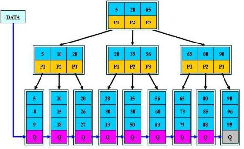

## 七、索引

索引是一个单独的、存在磁盘上的数据库结构，它们包含着对数据表里所有记录的引用指针。

### 1. 索引作用

提供了类似于书中目录的作用，目的是为了简化查询

### 2. 索引的种类

#### 2.1 按算法分

1. B树索引
2. Hash索引
3. R树
4. Full text
5. GIS



#### 2.2 按功能分

##### 2.2.1 聚簇索引

##### 2.2.2 辅助索引（二级索引）

辅助索引和 聚簇索引的区别

1. 聚簇索引只能有一个，非空唯一，一般是主键
2. 辅助索引可以有多个，是配合聚簇索引使用的
3. 聚簇索引叶节点就是磁盘数据行存储的数据页
4. MySQL根据聚簇索引组织存储结构，数据存储时就是按照聚簇索引的顺序进行存储数据
5. 辅助索引只会提取索引键值进行自动排序生成B树

### 3. 辅助索引的分类

#### 3.1 普通索引

基本索引类型，允许在定义索引的列中插入重复值和空值，其作用只是加快数据的访问速度。

#### 3.2 唯一索引

索引列的值必须唯一，可以允许有空值，可以减少查询索引列操作的时间，尤其是对比较庞大的数据表

#### 3.3 单列索引

一个索引只包含单个列，一个表可以有多个单列索引

#### 3.4 组合索引

在表的多个字段上组个创建索引，只有在查询条件中使用了这些字段的左边字段时，索引才会被使用

### 4. 索引树高度的影响因素

1. 数据量级，解决方法：分库，分表，分布式
2. 索引列值过长，解决方法：前缀索引
3. 数据类型

### 5. 创建索引

#### 5.1. 创建表的时候创建索引

语法规则

```mysql
CREATE TABLE 表名(字段名 数据类型 [完整性约束条件],
[UNIQUE | FULLTEXT | SPATIAL ] INDEX | KEY
[别名] (字段名 [(长度)] [ASC | DESC ] )
);

UNIQUE:唯一性索引
FULLTEXT：全文索引
SPATIAL：空间索引
INDEX|KEY ：作用相同，用来执行创建索引
长度：指定索引的长度
ASC | DESC ： 升序或降序的索引值存储
```

##### 5.1.1 创建普通索引

```mysql
CREATE TABLE accounts(
            id int PRIMARY KEY AUTO_INCREMENT,
            username VARCHAR(20),
            password VARCHAR(20),
            INDEX(username)
            );
```

##### 5.1.2 创建唯一索引

```mysql
CREATE TABLE accounts(
            id int PRIMARY KEY AUTO_INCREMENT,
            username VARCHAR(20),
            password VARCHAR(20),
            UNIQUE INDEX(username)
            );
```

##### 5.1.3 创建单列索引

```mysql
CREATE TABLE accounts(
            id int PRIMARY KEY AUTO_INCREMENT,
            username VARCHAR(20),
            password VARCHAR(20),
            UNIQUE INDEX user(username)
            );
```

##### 5.1.4 创建组合索引

```mysql
CREATE TABLE accounts(
username VARCHAR(20),
email VARCHAR(50),
password VARCHAR(20),
INDEX user(username,email)
);
```

#### 5.2.  在已经存在的表上创建索引

##### 5.2.1 使用ALTER TABLE语句创建索引

语法规则

```mysql
ALTER TABLE 表名 ADD [UNIQUE|FULLTEXT|SPATIAL] [INDEX|KEY] [索引名] (字段名[(长度)] [ASC|DESC])
```

例：

```mysql
ALTER TABLE accounts ADD INDEX user (username);
```

##### 5.2.2 使用CREATE INDEX创建索引

语法规则

```mysql
CREATE [UNIQUE|FULLTEXT|SPATIAL] INDEX 索引名 ON 表名 (字段名 [(长度)] [ASC|DESC])
```

```mysql
CREATE UNIQUE INDEX user on accounts (username);
```

### 6. 删除索引

#### 6.1 使用ALTER TABLE删除索引

语法规则

```mysql
ALTER TABLE 表名 DROP INDEX 索引名;
```

#### 6.2 使用DROP INDEX语句删除索引

```mysql
DROP INDEX 索引名 ON 表名;
```

### 7. 查看索引

```mysql
SHOW INDEX FROM city;
```

### 8. 索引建立原则

1. 建表时一定要有主键，一般是一个无关列
2. 选择唯一性索引
3. 限制所有的数目
4. 大表加索引需要在业务不繁忙期间操作
5. 尽量少在经常更新值得列上创建索引