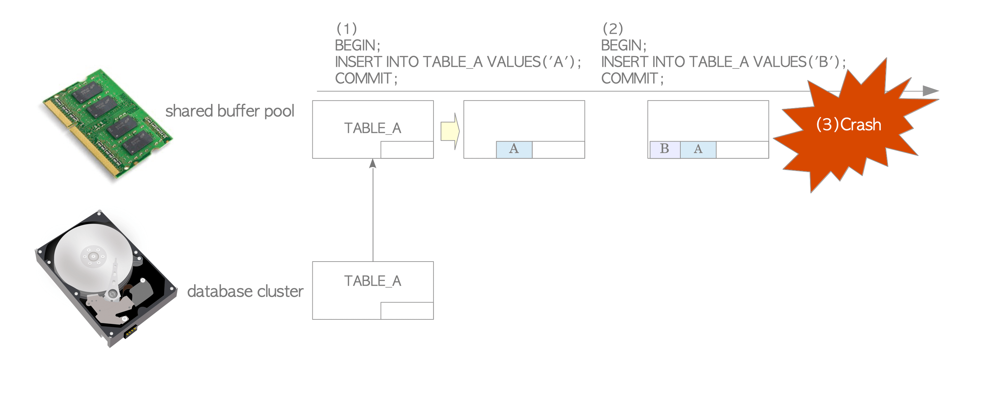
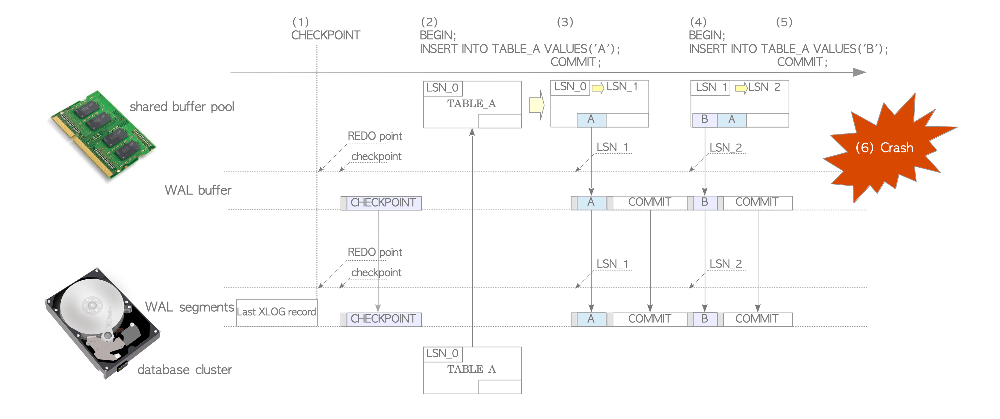
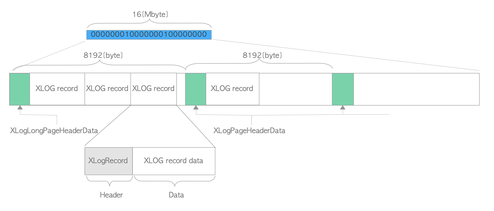
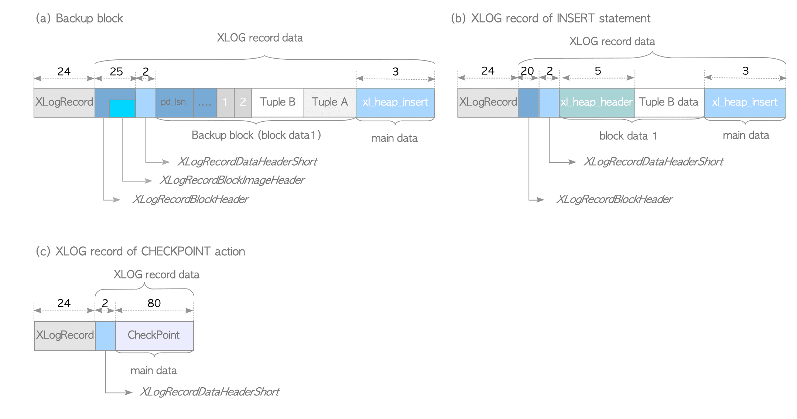
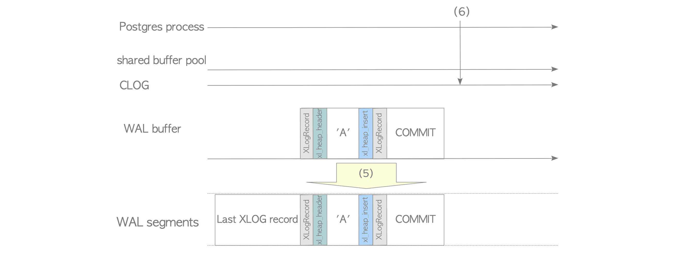

## WAL

事务日志是数据库至关重要的一部分，因为在出现系统故障时，数据库管理系统都允许丢失数据。事务日志是数据库系统中所有变更与行为的历史记录，当电源故障或其他服务器错误等导致服务器崩溃时，使用它可以确保数据不会丢失。由于事务日志包含每个已执行事务的相关信息，因此当服务器崩溃时，数据库服务器应能通过重放事务日志中的变更与行为来恢复数据库集群。
WAL(Write Ahead Logging)，指的是将变更与行为写入事务日志的协议或规则，而在PostgreSQL中，WAL是Write Ahead Log的缩写，它被当成事务日志的同义词，而且也用来指代一种将行为写入事务日志的实现机制。虽然这有些令人困惑，但是本章将使用PostgreSQL中的定义。
WAL机制用以减轻服务器崩溃带来的影响。它还是时间点恢复（Point-in-Time Recovery,PITR）与流复制（Streaming Replication,SR）实现的基础。

### 1. 没有WAL的插入操作

 

1. 发起第1条INSERT 语句时，PostgreSQL从数据库集簇文件中加载TABLE_A的页面到内存中的共享缓冲池，然后向页面中插入一条元组。页面并没有被立刻写回到数据库集簇文件中。
2. 当发起第2条INSERT语句时，PostgreSQL直接向缓冲池中的页面添加了一条新元组，这一页面仍然没有被写回持久化存储中。
3. 如果操作系统或 PostgreSQL服务器因为各种原因失效（如电源故障），那么所有插入的数据都会丢失。

因此，没有WAL的数据库在系统崩溃时是很脆弱的。

### 2. 有WAL的插入操作

为了解决上述系统故障问题，同时又不导致性能损失，PostgreSQL引入了WAL。将所有修改作为历史数据写入持久化存储中。这份历史数据被称为XLOG记录或WAL数据。
当插入、删除、提交等变更动作发生时，PostgreSQL会将 XLOG记录写入内存中的 WAL缓冲区。当事务提交或中止时，它们会被立即写入持久化存储的WAL段文件中。XLOG记录的日志序列号（Log Sequence Number,LSN）标识了该记录在事务日志中的位置，记录的LSN被用作XLOG记录的唯一标识符。当数据库系统恢复时，PostgreSQL从重做点（即最新的检查点开始时XLOG记录写入的位置）开始恢复的。

 

1. checkpointer 进程是一个后台进程，定期执行 checkpoint。当 checkpointer 进程启动时，它会向当前WAL段文件写入一条XLOG记录（这个记录被称为checkpoint record）。这条记录包含了最新的REDO点的位置。
2. 当发起第1条INSERT语句时，PostgreSQL从数据库文件中加载表A的页面至内存中的共享缓冲池，向页面中插入一条元组，然后在LSN_1位置创建并写入一条相应的XLOG记录，再将表A的LSN从LSN_0更新为LSN_1。在本例中，XLOG记录是由首部数据与完整元组组成的一对值。
3. 当该事务提交时，PostgreSQL向WAL缓冲区创建并写入一条关于该提交行为的XLOG记录，再将WAL缓冲区中的所有XLOG记录写入WAL段文件中。
4. 当发起第2条 INSERT 语句时，PostgreSQL首先向页面中插入一条新元组，然后在LSN_2位置创建并写入一条相应的XLOG记录，最后将表A的LSN从LSN_1更新为LSN_2
5. 当这条语句的事务提交时，PostgreSQL执行同第3步类似的操作。
6. 假设当操作系统此时crash，尽管共享缓冲区中的所有数据都丢失了，但是所有页面修改已经作为历史记录被写入WAL段文件中。

数据库重启时会自动进入恢复模式，PostgreSQL会从重做点开始，依序读取正确的WAL段文件并重放XLOG记录。将数据库集簇恢复到崩溃时刻前的状态。

 

1. PostgreSQL从相关的WAL段文件中读取第1条INSERT 语句的XLOG记录，并从硬盘上的数据库目录加载表A的页面到内存中的共享缓冲区中。
2. 在重放XLOG记录前，PostgreSQL会比较XLOG记录的LSN与相应页面的LSN。
    1. 如果XLOG记录的LSN比页面的LSN大，XLOG记录中的数据部分就会被插入页面中，并将页面的LSN更新为XLOG记录的LSN。
    2. 如果XLOG记录的LSN比页面的LSN小，那么不用做任何事情，直接读取后续的WAL数据即可。
3. PostgreSQL按照同样的方式重放其余的XLOG记录。

PostgreSQL可以通过按时间顺序重放写在WAL段文件中的XLOG记录来自我恢复，因此，PostgreSQL的XLOG记录显然是一种REDO日志。PostgreSQL不支持UNDO日志。

### 3. 事务日志和WAL段文件

#### 1. WAL文件名

 

PostgreSQL中的事务日志默认被划分成大小为16MB的文件，这些文件被称作WAL段，存放在$PGDATA/pg_wal目录下。
WAL段文件的文件名是由24个十六进制数组成的，其命名规则如下：
第一个WAL段文件名是000000010000000000000001，如果第一个段被XLOG记录写满了，就会创建第二个段000000010000000000000002，后续的文件名将使用升序。在0000000100000000000000FF被填满之后，就使用下一个文件000000010000000100000000。通过这种方式，每当最后两位数字要进位时，中间8位数字就会加1。与之类似，在0000000100000001000000FF 被填满后，就会开始使用000000010000000200000000，以此类推。

查看当前的LSN使用的那个wal文件

```sql
postgres=# select pg_current_wal_lsn();
 pg_current_wal_lsn 
--------------------
 1/13043AC0  #  / 左边的1表示wal段名字中间8位的值，/ 右边2位表示当前wal段名字使用的序列号
(1 row)

postgres=# select pg_walfile_name('1/13043AC0');
     pg_walfile_name      
--------------------------
 000000040000000100000013
(1 row)
```

pg_wal下最大的wal文件不一定时当前正在使用的，PostgreSQL会提前创建出几个WAL文件。

```bash
postgres@ubuntu:~$ ls -1 $PGDATA/pg_wal
00000002.history
00000003.history
000000040000000100000011
000000040000000100000012
000000040000000100000013
000000040000000100000014
000000040000000100000015
00000004.history
archive_status
```

#### 2. WAL的内部布局

 

XLOG记录的三类数据 （version 9.5 or later ）

 

#### 3. WAL记录的写入

```sql
INSERT INTO tbl VALUES ('A');
```

 

 

当执行insert时内部函数exec_simple_query()会被调用，其内部的执行如下：

1. 函数ExtendCLOG()将当前事务的状态IN_PROGRESS写入内存中的CLOG。
2. 函数heap_insert()向共享缓冲池的目标页面中插入堆元组，创建当前页面的XLOG记录，并执行函数XLogInsert()。
3. 函数XLogInsert()会将heap_insert()创建的XLOG记录写入WAL缓冲区LSN_1处，并将被修改页面的pd_lsn从LSN_0更新为LSN_1。
4. 函数 finish_xact_command()会在提交该事务时被调用，用于创建该提交动作的XLOG记录，而这里的XLogInsert()函数会将该记录写入WAL缓冲区LSN_2处。
5. 函数 XLogWrite()会刷写 WAL 缓冲区，并将所有内容写入 WAL 段文件中。如果wal_sync_method参数被配置为open_sync或open_datasync，记录会被同步写入，因为函数会使用带有O_SYNC或O_DSYNC标记的open()系统调用。
6. 函数 TransactionIdCommitTree()将提交日志 CLOG 中当前事务的状态从IN_PROGRESS更改为COMMITTED。

在上面的例子中，COMMIT操作导致XLOG记录写入WAL段文件。但发生下列任一情况，都会执行这种写入操作：

1. 一个运行中的事务提交或中止。
2. WAL缓冲区被写入的元组填满（WAL缓冲区的大小由参数wal_buffers控制）。
3. WAL写入进程周期性地执行写入操作

如果出现上述情况之一，无论其事务是否已提交，WAL缓冲区上的所有WAL记录都将被写入WAL段文件中。

其他触发WAL写的操作：

1. COMMIT操作会写入包含提交的事务ID的XLOG记录。
2. Checkpoint 操作会写入关于该检查点概述信息的XLOG记录。
3. SELECT语句在一些特殊情况下也会创建XLOG记录。例如在SELECT语句的处理过程中，如果HOT (Heap Only Tuple) 需要删除不必要的元组并拼接必要的元组，那么修改对应页面的XLOG记录就会被写入WAL缓冲区。

### 4. walwriter进程

WAL写入是一个后台进程，用于定期检查WAL缓冲区，并将所有未写入的XLOG记录写入WAL段文件。这个进程的目的是避免XLOG记录的突发写入。如果没有启用该进程，则在一次提交大量数据时，XLOG记录的写入可能会成为瓶颈。
WAL写入默认是启用的，无法禁用。但检查间隔可以通过参数wal_writer_delay 进行配置，默认值为200ms

### 5. WAL日志切换

WAL满足以下条件发生日志切换

1. WAL段已经写满。
2. 函数pg_switch_xlog()（10.0版本以后为pg_switch_wal()）被调用。
3. 启用了archive_mode，且已经超过archive_timeout配置的时间。

被切换的文件通常会被回收（重命名或重用），以供未来使用。但如果不需要的话，也可能会被移除。

