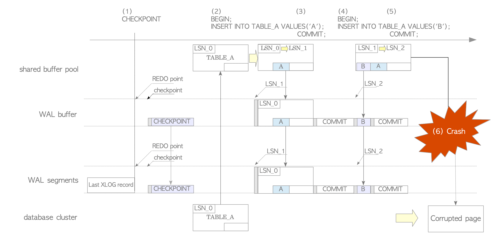
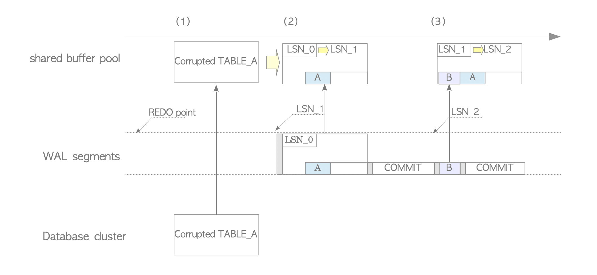

## 一、全页写的目的

操作系统通常使用4KB的页面，PostgreSQL默认使用8KB的页面，假设后台写入进程在写入脏页的过程中出现了操作系统故障，能出现只写入一个4KB页面的情况，导致磁盘上表A的页面数据损坏，那么XLOG是无法在损坏的页面上重放的，全页写的功能可以防止这种失效。如果启用全页写，PostgreSQL会在每个检查点之后，在每个页面第一次发生变更时，将整个页面及其首部元信息字段作为一条XLOG记录写入，这个功能默认是开启的。在PostgreSQL中，这种包含完整页面的XLOG记录被称为备份区块或整页镜像。

## 二、全页写的过程
 

1. 检查点程序启动检查点进程。
2. 当第1条INSERT语句执行插入操作时，这里的XLOG记录是当前页的备份区块（即包含了完整的页面），因为这是最近一次检查点之后该页面的第一次写入。
3. 当事务提交时与普通过程相同。
4. 当第2条INSERT语句进行插入操作时，与普通操作无差异，这里的XLOG记录就不是备份区块了。
5. 当这条语句事务提交时与普通过程相同。
6. 后台写入进程在向磁盘写入脏页的过程中出现了操作系统故障，导致磁盘上表A的页面数据损坏。

## 三、备份区块恢复过程

 

1. PostgreSQL读取第1条INSERT语句的XLOG记录，并从数据库集簇目录加载表A的页面至共享缓冲池中。在本例中，按照整页写入的规则，这条XLOG记录是一个备份区块。
2. 当一条XLOG记录是备份区块时，会使用另一条重放规则：XLOG记录的数据部分会直接覆盖当前页面，无视页面或XLOG记录中的LSN，然后将页面的LSN更新为XLOG记录的LSN。将TAIBLE_A的LSN更新为LSN_1。通过这种方式，损坏的页面可以通过它自己的备份区块恢复。
3. 因为第2条XLOG记录不是备份区块，恢复操作与普通恢复流程相同
