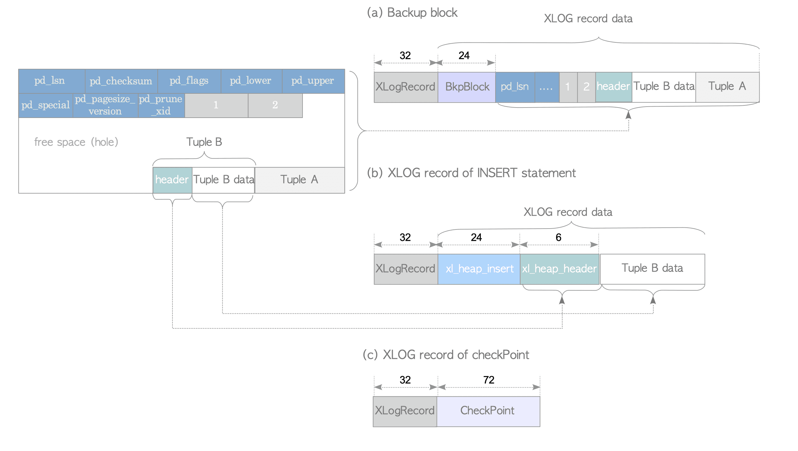
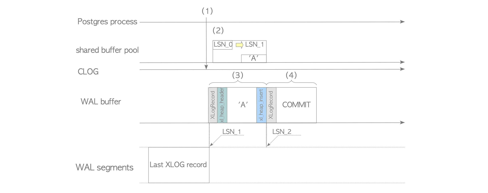
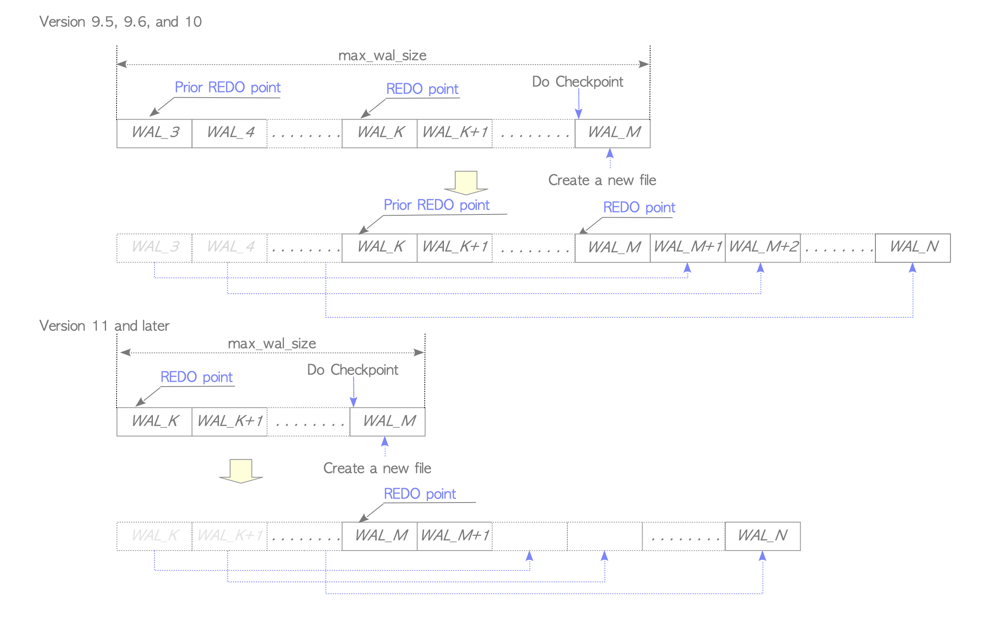

## 一、WAL机制

事务日志是数据库至关重要的一部分，因为在出现系统故障时，数据库管理系统都不允许丢失数据。事务日志是数据库系统中所有变更与行为的历史记录，当电源故障或其他服务器错误等导致服务器崩溃时，使用它可以确保数据不会丢失。由于事务日志包含每个已执行事务的相关信息，因此当服务器崩溃时，数据库服务器能通过重放事务日志中的变更与行为来恢复数据库集群。
WAL(Write Ahead Logging)，指的是将变更与行为写入事务日志的协议或规则，而在PostgreSQL中，WAL是Write Ahead Log（预写式日志）的缩写，它被当成事务日志的同义词，而且也用来指代一种将行为写入事务日志的实现机制。
WAL机制作用：
1. 减轻服务器崩溃带来的影响。
2. 时间点恢复（Point-in-Time Recovery,PITR）与流复制（Streaming Replication,SR）实现的基础。

### 1. 没有WAL的插入

 

1. 发起第1条INSERT语句时，PostgreSQL从数据库集簇文件中加载TABLE_A的页面到内存中的共享缓冲池，然后向页面中插入一条元组。页面并没有被立刻写回到数据库文件中。
2. 当发起第2条INSERT语句时，PostgreSQL直接向缓冲池中的页面添加了一条新元组，这一页面仍然没有被写回持久化存储中。
3. 如果操作系统或PostgreSQL服务器因为各种原因失效（如电源故障），那么所有插入的数据都会丢失。

因此，没有WAL的数据库在系统崩溃时是很脆弱的。

### 2. 有WAL的插入

为了解决上述系统故障问题，同时又不导致性能损失，PostgreSQL引入了WAL。将所有修改作为历史数据写入持久化存储中。这份历史数据被称为XLOG记录或WAL数据。
当插入、删除、提交等变更动作发生时，PostgreSQL会将XLOG记录写入内存中的WAL缓冲区。当事务提交或中止时，它们会被立即写入持久化存储的WAL段文件中。XLOG记录的日志序列号（Log Sequence Number,LSN）标识了该记录在事务日志中的位置，记录的LSN被用作XLOG记录的唯一标识符。当数据库系统恢复时，PostgreSQL从REDO点（即最新的检查点开始时XLOG记录写入的位置）开始恢复。

 

1. checkpointer进程是一个后台进程，定期执行checkpoint。当checkpointer进程启动时，它会向当前WAL段文件写入一条XLOG记录（这个记录被称为checkpoint record）。这条记录包含了最新的REDO点的位置。
2. 当发起第1条INSERT语句时，PostgreSQL从数据库文件中加载TABLE_A的页面至内存中的共享缓冲池，向页面中插入一条元组，然后在LSN_1位置创建并写入一条相应的XLOG记录，再将TABLE_A的LSN从LSN_0更新为LSN_1。
3. 当该事务提交时，PostgreSQL向WAL缓冲区创建并写入一条关于该提交行为的XLOG记录，再将WAL缓冲区中的所有XLOG记录写入WAL段文件中。
4. 当发起第2条INSERT语句时，PostgreSQL首先向页面中插入一条新元组，然后在LSN_2位置创建并写入一条相应的XLOG记录，最后将TABLE_A的LSN从LSN_1更新为LSN_2。
5. 当这条语句的事务提交时，PostgreSQL执行同第3步类似的操作。
6. 假设操作系统此时crash，尽管共享缓冲区中的所有数据都丢失了，但是所有页面修改已经作为历史记录被写入WAL段文件中。

## 3. 事务日志和WAL段文件

LSN由64位组成，即有2^64个日志编号.PostgreSQL中的事务日志默认被划分成大小为16MB的文件，这些文件被称作WAL段，存放在$PGDATA/pg_wal目录下。

### 1. WAL文件名

WAL段文件的文件名是由24个十六进制数组成的，其命名规则如下：
第一个WAL段文件名是000000010000000000000001，如果第一个段被XLOG记录写满了，就会创建第二个段000000010000000000000002，后续的文件名将使用升序。在0000000100000000000000FF被填满之后，就使用下一个文件000000010000000100000000。通过这种方式，每当最后两位数字要进位时，中间8位数字就会加1。与之类似，在0000000100000001000000FF 被填满后，就会开始使用000000010000000200000000，以此类推。pg_wal下最大的wal文件不一定时当前正在使用的，PostgreSQL会提前创建出几个WAL文件。

 


查看当前的LSN使用的哪个wal文件

```sql
postgres=# select pg_current_wal_lsn();
 pg_current_wal_lsn 
--------------------
 1/151FFF80
(1 row)

postgres=# select pg_walfile_name('1/151FFF80');
     pg_walfile_name      
--------------------------
 000000040000000100000015
(1 row)
```


WAL段文件名称含义：

```sql
00000004 00000001 00000015
-------- -------- --------
时间线标识  LogId    LogSeg
```

- 时间线标识：timelineId,是以1起始递增的正整数
- LogId：逻辑日志文件号，是以1起始递增的正整数
- LogSeg：段文件号，是以1起始递增的正整数

LSN编号规则：

```sql
1/151FFF80
-- X/YYZZZZZZ
-- (高32位/低32位)
```

wal日志的logSeg前6位始终是0，后两位是LSN低32位的前两位。如上例中logSeg最后两位是15，LSN低32前两位也是15。LSN在wal日志中的偏移量即LSN低32位中后24位对应的十进制值。

```sql
postgres=# SELECT ( x'1FFF80' )::int AS offset_computed, pg_walfile_name_offset( '1/151FFF80' );
 offset_computed |       pg_walfile_name_offset       
-----------------+------------------------------------
         2097024 | (000000010000000100000015,2097024)
(1 row)

```

LogId和LogSeg的计算

```sql
postgres=# select pg_current_wal_lsn();
 pg_current_wal_lsn 
--------------------
 1/151FFF80
(1 row)

-- 获取公式中LSN号
postgres=# select x'1151FFF80'::bigint;
    int8    
------------
 4649385856
(1 row)

--利用公式计算LogSeg段文件号
postgres=# select to_hex((4649385856-1)/(16*1024*1024) %256); 
 to_hex 
--------
 15
(1 row)

--利用公式计算LogId逻辑文件号
postgres=# select to_hex((4649385856-1)/(16*1024*1024*256::bigint));
 to_hex 
--------
 1
(1 row)
```


### 2. WAL的内部布局

一个WAL段文件的默认大小为16MB，并且其内部被划分成大小为8192B（8KB）的多个页面。

 


#### XLOG记录的数据部分

##### 9.4版本以下

 

XLOG记录的数据部分可以分为两类：备份区块（完整的页面）或非备份区块。

##### 9.5版本以上

 

### 3. WAL记录的写入

```sql
INSERT INTO tbl VALUES ('A');
```

 

 

当执行insert时内部函数exec_simple_query()会被调用，其内部的执行如下：

1. 函数ExtendCLOG()将当前事务的状态IN_PROGRESS写入内存中的CLOG。
2. 函数heap_insert()向共享缓冲池的目标页面中插入堆元组，创建当前页面的XLOG记录，并执行函数XLogInsert()。
3. 函数XLogInsert()会将heap_insert()创建的XLOG记录写入WAL缓冲区LSN_1处，并将被修改页面的pd_lsn从LSN_0更新为LSN_1。
4. 函数 finish_xact_command()会在提交该事务时被调用，用于创建该提交动作的XLOG记录，而这里的XLogInsert()函数会将该记录写入WAL缓冲区LSN_2处。
5. 函数 XLogWrite()会刷写WAL缓冲区，并将所有内容写入WAL段文件中。如果wal_sync_method参数被配置为open_sync或open_datasync，记录会被同步写入，因为函数会使用带有O_SYNC或O_DSYNC标记的open()系统调用。
6. 函数TransactionIdCommitTree()将提交日志CLOG中当前事务的状态从IN_PROGRESS更改为COMMITTED。

在上面的例子中，COMMIT操作导致XLOG记录写入WAL段文件。但发生下列任一情况，都会执行这种写入操作：

1. 一个运行中的事务提交或中止。
2. WAL缓冲区被写入的元组填满（WAL缓冲区的大小由参数wal_buffers控制）。
3. WAL写入进程周期性地执行写入操作

如果出现上述情况之一，无论其事务是否已提交，WAL缓冲区上的所有WAL记录都将被写入WAL段文件中。

其他触发WAL写的操作：

1. COMMIT操作会写入包含提交的事务ID的XLOG记录。
2. Checkpoint 操作会写入关于该检查点概述信息的XLOG记录。
3. SELECT语句在一些特殊情况下也会创建XLOG记录。例如在SELECT语句的处理过程中，如果HOT (Heap Only Tuple) 需要删除不必要的元组并拼接必要的元组，那么修改对应页面的XLOG记录就会被写入WAL缓冲区。

### 4. 查看WAL的日志内部

```sql
-- 安装扩展
postgres=# create extension pageinspect;
CREATE EXTENSION
-- 先创建一张表
postgres=# CREATE TABLE tbl(id integer);
CREATE TABLE
postgres=# INSERT INTO tbl VALUES (1);
INSERT 0 1
-- 开始一个事务，并记住插入WAL的位置：
postgres=# BEGIN;
BEGIN
postgres=# SELECT pg_current_wal_insert_lsn();
 pg_current_wal_insert_lsn 
---------------------------
 1/17040218
(1 row)
-- 更新一行数据
postgres=# UPDATE tbl set id = id + 1;
UPDATE 1
-- 此更改已被WAL记录，并且插入位置已更改
postgres=# SELECT pg_current_wal_insert_lsn();
 pg_current_wal_insert_lsn 
---------------------------
 1/17040298
(1 row)
-- 为了确保在WAL记录之前不会将更改后的数据页刷新到磁盘，与该页相关的最后一个WAL记录的LSN存储在页头中
postgres=# SELECT lsn FROM page_header(get_raw_page('tbl',0));
    lsn     
------------
 1/17040298
(1 row)
-- 此时提交事务
postgres=# COMMIT;
COMMIT
-- 提交也被WAL记录，并且位置再次更改
postgres=# SELECT pg_current_wal_insert_lsn();
 pg_current_wal_insert_lsn 
---------------------------
 1/17040330
(1 row)
-- 创建的WAL记录将被一次写入磁盘
postgres=# SELECT pg_current_wal_lsn(), pg_current_wal_insert_lsn();
 pg_current_wal_lsn | pg_current_wal_insert_lsn 
--------------------+---------------------------
 1/17040330         | 1/17040330
(1 row)
-- 通过lsn，我们可以比较两个lsn之间的wal记录数量（单位是字节），现在查一下begin到commit
postgres=# SELECT '1/17040330'::pg_lsn - '1/17040218'::pg_lsn;
 ?column? 
----------
      280
(1 row)
-- 可知整个过程在WAL中需要296个字节，这可以评估服务器在一定负载下每单位时间生成的WAL记录的数量
```

 可以使用pg_waldump查看创建的wal记录情况 

```bash
postgres@ubuntu:~$ pg_waldump  -s 1/17040218 -e 1/17040330 -p $PGDATA/pg_wal  000000040000000100000017
rmgr: Standby     len (rec/tot):     50/    50, tx:          0, lsn: 1/17040218, prev 1/170401F0, desc: RUNNING_XACTS nextXid 1049913 latestCompletedXid 1049912 oldestRunningXid 1049913
rmgr: Heap        len (rec/tot):     69/    69, tx:    1049913, lsn: 1/17040250, prev 1/17040218, desc: HOT_UPDATE off 1 xmax 1049913 flags 0x40 ; new off 2 xmax 0, blkref #0: rel 1663/12675/25840 blk 0
rmgr: Standby     len (rec/tot):     54/    54, tx:          0, lsn: 1/17040298, prev 1/17040250, desc: RUNNING_XACTS nextXid 1049914 latestCompletedXid 1049912 oldestRunningXid 1049913; 1 xacts: 1049913
rmgr: Heap2       len (rec/tot):     56/    56, tx:    1049913, lsn: 1/170402D0, prev 1/17040298, desc: CLEAN remxid 0, blkref #0: rel 1663/12675/25350 blk 78
rmgr: Transaction len (rec/tot):     34/    34, tx:    1049913, lsn: 1/17040308, prev 1/170402D0, desc: COMMIT 2023-05-11 22:42:27.878084 CST
```

 第二行可以看到第一个是HOT_UPDATE操作，与堆资源管理器有关，文件名和页码在`blkref`字段中指定，此处为1663/12675/25840

```sql
postgres=# select pg_relation_filepath('tbl');
 pg_relation_filepath 
----------------------
 base/12675/25840
(1 row)
```

 第三行可以看到COMMIT，与事务资源管理器有关.

## 4. walwriter进程

walwriter是一个后台进程，用于定期检查WAL缓冲区，并将所有未写入的XLOG记录写入WAL段文件。这个进程的目的是避免XLOG记录的突发写入。如果没有启用该进程，则在一次提交大量数据时，XLOG记录的写入可能会成为瓶颈。
walwriter默认是启用的，无法禁用。但检查间隔可以通过参数wal_writer_delay进行配置，默认值为200ms。

## 5. WAL日志切换

WAL满足以下条件发生日志切换

1. WAL段已经写满。
2. 函数pg_switch_xlog()（10.0版本以后为pg_switch_wal()）被调用。
3. 启用了archive_mode，且已经超过archive_timeout配置的时间。

被切换的文件通常会被回收（重命名或重用），以供未来使用。但如果不需要的话，也可能会被移除。

```bash
postgres=# select pg_switch_wal();
 pg_switch_wal 
---------------
 1/13043AD8
(1 row)

postgres=#
```


## 6. WAL段管理

### 6.1 9.4版本以前

WAL段文件的数量主要由下列3个参数控制：

1. checkpoint_segments
2. checkpoint_completion_target
3. wal_keep_segments

WAL段文件的数量通常有以下几个特点：

1. 比((2 + checkpoint_completion_target) × checkpoint_segments + 1)大.
2. 比(checkpoint_segments + wal_keep_segments + 1)大
3. 不超过(3×checkpoint_segments+1)个文件

当消耗了超过checkpoint_segments个数量的文件时，就会启动检查点进程因此可以保证WAL段文件中总是包含至少两个Redo点，文件的数量始终大于2×checkpoint_segments。

PostgreSQL总是会保留足够用于恢复的WAL段文件数（有时候会超出必要的量）。checkpoint_segments如果设置的值较小，则checkpoint频繁发生，会导致性能下降，而如果设置的值较大，则WAL文件总是需要巨大的磁盘空间，但其中一些空间不是必要的。

### 6.2  9.5版本以后

checkpoint_segments参数被弃用。

每当检查点进程启动时，PostgreSQL都会估计并准备下一个检查点周期所需的WAL段文件数。这种估计基于前一个检查点周期中消耗的文件数量，即从包含上一个重做点的段文件开始计数，而这个值应当在min_wal_size（默认值为80MB,5个文件）与max_wal_size 之间（默认值为1GB,64个文件）。如果检查点进程启动，必要的段文件就会被保留或回收，不必要的段文件就会被移除。

 

假设在检查点开始前有6个文件，WAL_3包含了上一个REDO点（10.0及更低版本，11.0版本后就是当前重做点）,PostgreSQL估计需要5个文件，在这种情况下，WAL_1被重命名为WAL_7回收利用，而WAL_2被移除。任何比包含上一个重做点的段文件更老的段文件都可以被移除。

 

如上图，如果出现了WAL活动尖峰，导致需要更多的文件，新的文件就会被创建，而WAL文件的总大小小于max_wal_size。

WAL文件的数量会根据服务器活动而自动适配。如果WAL数据写入量持续增加，则WAL段文件的估计数量以及WAL文件的总大小也会随之增加。在相反的情况下（即WAL数据写入量减少），这些值也会减少。

 

如果WAL文件的总大小超过max_wal_size，则将启动检查点。检查点将会创建一个新的重做点，最近的重做点将会变为上一个重做点，不必要的文件将被回收。通过这种方式，PostgreSQL将始终只保留数据库恢复所必需的WAL段文件。

max_wal_size是一个软限制，在特殊的情况下WAL尺寸可能会超过max_wal_size， 例如在重度负荷下、archive_command失败或者高的wal_keep_segments设置。默认为1GB。增加这个参数可能导致崩溃恢复所需的时间。 

```bash
postgres=# show max_wal_size;
 max_wal_size 
--------------
 1GB
(1 row)
postgres=# show min_wal_size;
 min_wal_size 
--------------
 80MB
(1 row)
```

