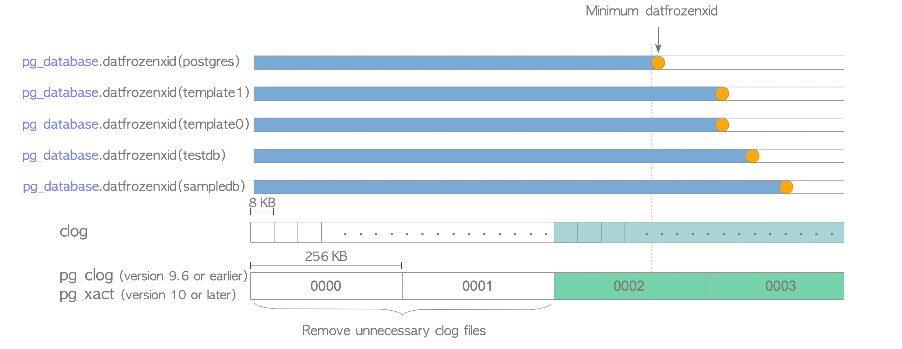

## CLOG概述

CLOG用来记录事务号的状态，主要是用来判断行的可见性。每个事务状态占用两个bit位。事务的状态有4种：IN PROGRESS，COMMITTED，ABORTED和SUB_COMMITTED。CLOG由一个或多个8KB页组成。CLOG在逻辑上形成一个数组，数组的每个元素对应事务ID号和事务状态。

一个事务占用2个bit位，一个字节可以存放4个事务状态，一个页块可以存放8192*4=32768个事务状态。

当数据库库启动时，这些文件会被加载到内存中。CLOG的信息同样会被记录到wal日志中，当数据库异常中断时，CLOG的信息会从wal日志还原。

CLOG存放在缓存中，当checkpoint时开始刷新到CLOG文件中。当数据库库关闭库后，CLOG会被写入到$PGDATA/pg_xact子目录中，文件命名为0000,0001,00002......，单个文件最大为256K。

## CLOG工作方式


### CLOG如何维护

1. 数据库正常关闭或者检查点发生时，clog数据写入pg_xact目录下的文件中
2. 命名习惯：0000 0001 ……
3. 数据库启动时从pg_xact文件中加载数据
4. 由Vacuum进程定期处理


### 计算当前使用的CLOG数据块位置

一个事务占用2个bit位，一个字节可以存放4个事务状态，一个页块可以存放8192*4=32768个事务状态。

查看当前的TXID号

```sql
postgres=# SELECT txid_current();
 txid_current 
--------------
       448854
(1 row)
```

2、计算记录在哪个CLOG块中

```sql
postgres=# select 448854/(8192*4) block;
 block 
-------
    13
(1 row)
```

### 删除不需要的CLOG文件

当发生急性冻结时会更新pg_database.datfrozenxid的值，此时，如果某些CLOG文件不包含包含最小pg_database.datfrozenxid以及之前的信息，会尝试删除不必要的clog文件。因为这些CLOG文件中记录的事务所修改的行已经被冻结，那么在进行行可见性规则判断时就不需要获得该事务的状态。


