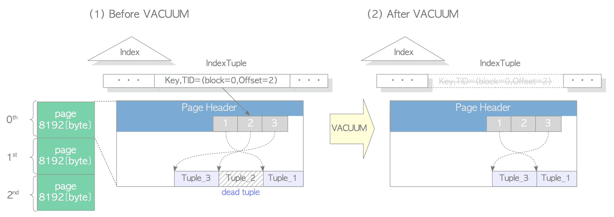
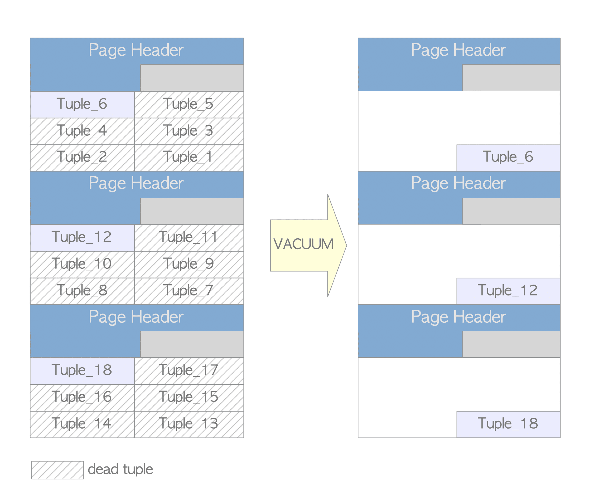
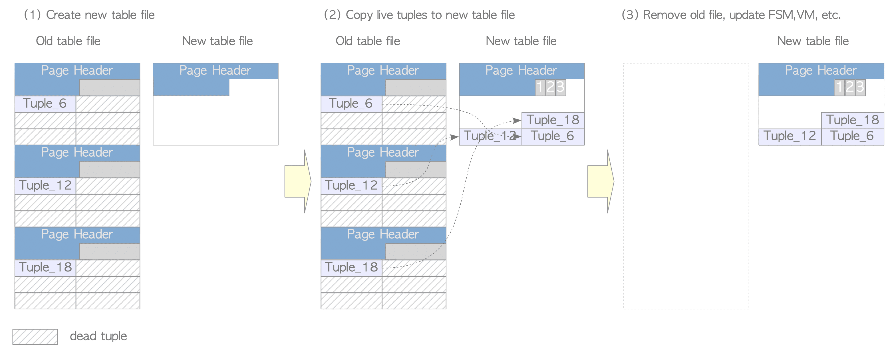

## vacuum作用

1. 移除死元组。
   - 移除每一页中的死元组，并对每一页内的活元组进行碎片整理。
   - 移除指向死元组的索引元组。
2. 冻结旧的事务标识。
   - 必要时冻结旧元组的事务标识。
   - 更新与冻结事务标识相关的系统视图（pg_database与pg_class）。
   - 如果可能，移除不必要的提交日志文件。
3. 其他。
   - 更新已处理表的空闲空间映射（FSM）和可见性映射（VM）。
   - 更新一些统计信息（pg_stat_all_tables等）。

## vacuum处理流程

1. 从指定的表集中依次处理每一张表。
2. 获取表上的ShareUpdateExclusiveLock锁，此锁允许其他事务对该表进行读取。
3. 扫描表中所有的页面，以获取所有的死元组，并在必要时冻结旧元组。
4. 删除指向相应死元组的索引元组（如果存在）。
5. 对表的每个页面执行步骤（6）和（7）中的操作。
6. 移除死元组，并重新分配页面中的活元组。
7. 更新目标表对应的FSM与VM。
8. 如果最后一个页面没有任何元组，则截断最后一页。
9. 更新与目标表清理过程相关的统计数据和系统视图。
10. 更新与清理过程相关的统计数据和系统视图。
11. 如果可能，移除CLOG中非必要的文件与页面。

移除死元组，并逐页更新FSM和VM示意图：


## 可见性地图

每个表都拥有各自的可见性映射，用于保存表文件中每个页面的可见性。页面的可见性确定了每个页面是否包含死元组。清理过程可以跳过没有死元组的页面。


假设该表包含三个页面，第0页和第2页包含死元组，而第1页不包含死元组。表的可见性映射中保存着那些页面包含死元组的信息。在这种情况下，清理过程可以参考VM中的信息，跳过第一个页面。

## 删除不需要的clog


CLOG存储着事务的状态。当更新pg_database.datfro zenxid时，PostgreSQL会尝试删除不必要的CLOG文件，相应的CLOG页面也会被删除。
如果CLOG文件0002中包含最小的pg_database.datfro zenxid，则可以删除旧文件（0000和0001），因为存储在这些文件中的所有事务在整个数据库集簇中已经被视为冻结了。

## autovacuum

默认每分钟执行一次，由autovacuum_naptime参数定义。
默认调用三个worker进程进行工作，由autovacuum_max_workers参数定义

## full vacuum



一个表由三个页面组成，每个页面包含6条元组。执行以下DELETE命令以删除元组，并执行VACUUM命令以移除死元组,死元组虽然都被移除了，但表的尺寸没有减小。这种情况既浪费了磁盘空间，又会对数据库性能产生负面影响。为了解决这种问题，PostgreSQL提供了full vacuum。



FULL VACUUM过程
1. 创建新的表文件：当对表执行VACUUM FULL命令时，PostgreSQL首先获取表上的AccessExclusiveLock锁，并创建一个大小为8KB的新的表文件。AccessExclusiveLock 锁不允许其他的任何访问。
2. 将活元组复制到新表：PostgreSQL只将旧表文件中的活元组复制到新表中。
3.删除旧文件，重建索引并更新统计信息FSM和VM：复制完所有活元组后，PostgreSQL将删除旧文件，重建所有相关的表索引，更新表的FSM和VM，并更新相关的统计信息和系统视图。

执行full vacuum的时机

```sql
postgres=# create table accounts (aid int, info text,   c_time timestamp);
CREATE TABLE
postgres=# insert into accounts select generate_series(1,100000), md5(random()::text),clock_timestamp();
INSERT 0 100000
postgres=# SELECT count(*) as "number of pages",
postgres-#        pg_size_pretty(cast(avg(avail) as bigint)) as "Av. freespace size",
postgres-#        round(100 * avg(avail)/8192 ,2) as "Av. freespace ratio"
postgres-#        FROM pg_freespace('accounts');
 number of pages | Av. freespace size | Av. freespace ratio 
-----------------+--------------------+---------------------
             935 | 32 bytes           |                0.39
(1 row)

postgres=# DELETE FROM accounts WHERE aid %10 != 0 OR aid < 100;
DELETE 90009
postgres=# VACUUM accounts;
VACUUM
postgres=# SELECT count(*) as "number of pages",
postgres-#        pg_size_pretty(cast(avg(avail) as bigint)) as "Av. freespace size",
postgres-#        round(100 * avg(avail)/8192 ,2) as "Av. freespace ratio"
postgres-#        FROM pg_freespace('accounts');
 number of pages | Av. freespace size | Av. freespace ratio 
-----------------+--------------------+---------------------
             935 | 6964 bytes         |               85.01
(1 row)

postgres=# SELECT *, round(100 * avail/8192 ,2) as "freespace ratio"
postgres-#                 FROM pg_freespace('accounts');
 blkno | avail | freespace ratio 
-------+-------+-----------------
     0 |  7648 |           93.00
     1 |  6944 |           84.00
     2 |  6944 |           84.00
     3 |  7008 |           85.00
     4 |  6944 |           84.00
     5 |  6944 |           84.00
     ...
postgres=# VACUUM FULL accounts;
VACUUM
postgres=# SELECT count(*) as "number of blocks",
postgres-#        pg_size_pretty(cast(avg(avail) as bigint)) as "Av. freespace size",
postgres-#        round(100 * avg(avail)/8192 ,2) as "Av. freespace ratio"
postgres-#        FROM pg_freespace('accounts');
 number of blocks | Av. freespace size | Av. freespace ratio 
------------------+--------------------+---------------------
               94 | 0 bytes            |                0.00
(1 row)
```
