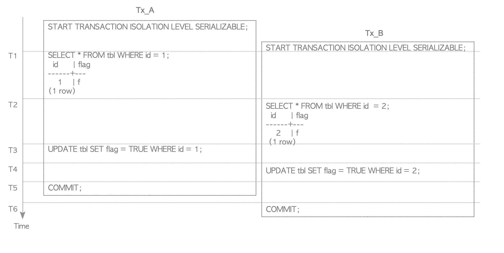
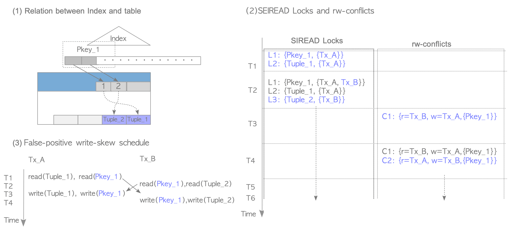

## ACID概述

ACID四大特性：
1. Atomicity(原子性)：一个事务(transaction)中的所有操作，要么全部完成，要么全部不完成，不会结束在中间某个环节。
2. Consistency(一致性)：在事务开始之前和事务结束以后，数据库的完整性没有被破坏。这表示写入的数据必须完全符合所有的预设规则，这包含数据的精确度、串联性以及后续数据库可以自发性地完成预定的工作。
3. Isolation(隔离性)：数据库允许多个并发事务同时对其数据进行读写和修改的能力，隔离性可以防止多个事务并发执行时由于交叉执行而导致数据的不一致。
3. Durability(持久性)：事务处理结束后，对数据的修改就是永久的，即便系统故障也不会丢失。

## PostgreSQL支持的事务隔离级别

| Isolation Level | Dirty Reads  | Non-repeatable Read | Phantom Read | Serialization Anomaly |
|-----------------|--------------|---------------------|--------------|-----------------------|
| READ COMMITTED  | Not possible | Possible            | Possible     | Possible              |
| REPEATABLE READ | Not possible | Not possible        | Not possible | Possible              |
| SERIALIZABLE    | Not possible | Not possible        | Not possible | Not possible          |


## MVCC概述

并发控制是一种在数据库中并发运行多个事务时保持一致性和隔离性的机制，这是ACID的两个属性。

并发控制技术:
- 多版本并发控制(MVCC)
- 严格的两阶段锁(S2PL)
- 乐观并发控制(OCC)

在MVCC中，每次写操作都会创建数据项的新版本，同时保留旧版本。当事务读取一个数据项时，系统会选择其中一个版本以确保单个事务的隔离。MVCC的主要优点是“读不阻止写，写不阻止读”，相反，例如，基于S2PL的系统必须在写卡器写入项时阻止读卡器，因为写卡器获取项的独占锁。PostgreSQL和一些rdbms使用MVCC的一个变体，称为快照隔离(Snapshot Isolation，SI)。

一些关系型数据库（例如Oracle）使用回滚段来实现快照隔离SI。当写入新数据对象时，旧版本对象先被写入回滚段，随后用新对象覆写至数据区域。PostgreSQL使用更简单的方法，即新数据对象被直接插入相关表页中。读取对象时，PostgreSQL根据可见性检查规则，为每个事务选择合适的对象版本作为响应。
SI中不会出现在ANSI SQL-92标准中定义的三种异常，分别是脏读、不可重复读和幻读。但SI无法实现真正的可串行化，因为在SI中可能会出现串行化异常，例如写偏差和只读事务偏差。需要注意的是，ANSI SQL-92标准中可串行化的定义与现代理论中的定义并不相同。为了解决这个问题，PostgreSQL 从9.1版本之后添加了可串行化快照隔离（Serializable Snapshot Isolation,SSI）,SSI可以检测串行化异常，并解决这种异常导致的冲突。因此，9.1版本之后的PostgreSQL提供了真正的SERIALIZABLE隔离等级（SQL Server也使用SSI，而Oracle仍然使用SI）。


### 事务状态

四种事务状态:
- IN_PROGRESS
- COMMITTED
- ABORTED
- SUB_COMMITTED


## Commit Log

### Clog 工作原理


CLOG在逻辑上是一个数组，由共享内存中一系列8KB页面组成。数组的序号索引对应着相应事务的标识，其内容则是相应事务的状态。

## 事务快照

内置函数txid_current_snapshot及其文本表示格式

```sql
testdb=# SELECT txid_current_snapshot();
txid_current_snapshot
-----------------------
100:104:100,102
(1 row)
```

txid_current_snapshot的文本表示为"xmin:xmax:xip_list"，含义如下
Xmin：最早仍在活动的txid。所有以前的事务要么提交并可见，要么回滚并停止。
Xmax：第一个尚未分配的txid。截至快照时，所有大于或等于此值的txid尚未启动，因此不可见。
xip_list：快照时的活动txid。该列表仅包含xmin和xmax之间的活动txid。

例如，在快照'100:104:100,102'中，xmin是'100'，xmax是'104'，xip_list是'100,102'。


(a)中`100:100:`表示：
- 因为xmin为100，所以txid < 100的事务不活跃。
- 因为xmax为100，所以txid ≥ 100的事务是活跃的。

(b)中`100:104:100,102`表示：
- txid < 100的事务不活跃。
- txid ≥ 104的事务是活跃的。
- txid等于100和102的事务是活跃的，因为它们在xip_list中，而txid等于101和103的事务不活跃。

### 事务管理器

不同隔离级别的事务快照状态


## 并发UPDATE时防止更新的数据丢失

并发UPDATE操作，隔离级别不同如何保护已修改的数据不丢失


(1)如果A事务回滚，则b事务能够更新成功
(2)当前事务尝试更新目标元组，但另一个并发事务已经更新了目标行并提交。在这种情况下，如果当前事务处于READ COMMITTED级别，则会更新目标行，否则会立即中止以防止丢失更新
(3)没有冲突，当前事务可以直接更新目标行


## 可串行化快照隔离

SSI(可串行化快照隔离)实施的基本策略


## 在PostgreSQL中实现SSI

SIREAD locks：在内部又被称为谓词锁，是一个由对象与（虚拟）事务标识构成的二元组；这个二元组存储着哪个事务访问了哪个对象的相关信息
rw-conflicts：读-写冲突是一个三元组，由SIREAD锁及两个分别读写该SIREAD锁的事务txid构成

## SSI怎样造成的

事务提交失败的原因是要保护事务A修改的结果，因为事务B是在可串行化事务隔离级别，所以无法看到事务A修改后的结果


## 假阳性可串行化快照隔离异常

两个事务分别查询和更新各自的行，所以不会影响，都能够提交成功。

### Using sequential scan

表没有索引，导致顺序扫描，两个事务操作时发生交叉访问同一个块




### Index scan using the same index page



如果表比较小，导致root和leaf索引块同属于一个块，两个事务也发生交叉访问同一个索引块

### Index scan using the difference index page

