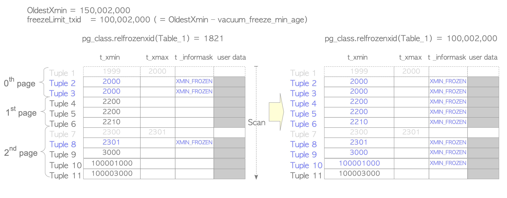

## 一、TXID（事务id）

当一个事务开始时，PostgreSQL中的事务管理系统会为该事务分配一个唯一标识符，即事务ID(txid)。PostgreSQL中的txid被定义为一个32位的无符号整数，也就是说，它能记录大约42亿个事务。通常txid对我们是透明的，但是我们可以利用PostgreSQL内部的函数来获取当前事务的txid。

```sql
postgres=# BEGIN;
BEGIN
postgres=# SELECT txid_current();
 txid_current 
--------------
          100
(1 row)
```

BEGIN命令没有指定txid。在PostgreSQL中，当第一个命令在BEGIN命令执行之后执行时，事务管理器会分配一个tixd，然后它的事务开始。

PostgreSQL保留以下三个特殊txid：
- 0表示无效的txid。
- 1表示初始启动的txid，仅用于数据库集群的初始化过程。
- 2表示冻结的txid

## 二、TXID使用原理

### 1. TXID结构


- TxID=2^32=42亿
- 前21亿个TxID是“过去的”
- 后21亿个TxID是“未来的”

### 2. TXID环绕


假设元组tuple_1的txid为100，即tuple_1的t_xmin为100。服务器已经运行很长一段时间了，Tuple_1没有被修改。当前的txid是21亿+100，执行SELECT命令。此时，Tuple_1可见，因为txid 100是过去的。接着，又执行相同的SELECT命令，此时当前的txid就变成是21亿+101了，根据行可见性规则判断Tuple_1就不再可见，因为txid 100变成是未来的了。

为了解决这个问题，PostgreSQL引入了一个冻结事务标识的概念，并实现了一个名为FREEZE的过程。
在PostgreSQL中定义了一个冻结的txid，它是一个特殊的保留值txid = 2，在参与事务标识大小比较时，它总是比所有其他txid都旧。换句话说，冻结的txid始终处于非活跃状态，且其结果对其他事务始终可见。
清理过程会调用冻结过程。冻结过程将扫描所有表文件，如果元组的t_xmin比当前txid- vacuum_freeze_min_age（默认值为5000万）更旧，则将该元组的t_xmin重写为冻结事务标识。
例如当前txid为5000万，此时通过VACUUM命令调用冻结过程。在这种情况下：
9.3及以前的版本：Tuple_1和Tuple_2的t_xmin都被重写为2。
9.4或更高版本中使用元组t_infomask字段中的XMIN_FROZEN标记位来标识冻结元组。


### 3. 冻结处理的两种模式

#### 3.1 Lazy Mode

```sql
freezeLimit_txid=(OldestXmin-vacuum_freeze_min_age)
```
OldestXmin是当前正在运行的事务中最早的事务标识。举个例子，如果在执行VACUUM命令时，还有其他三个事务正在运行，且其txid分别为100、101和102，那么OldestXmin就是100。如果不存在其他事务，OldestXmin就是执行此VACUUM命令的事务标识。这里vacuum_freeze_min_age是一个配置参数（默认值为50000000）。
AutoVacuum操作会进行冻结操作，每分钟都会执行一次，被选中的表都会进行vacuum操作，包含冻结txid内容。


第0页：三条元组被冻结，因为所有元组的t_xmin值都小于freezeLimit_txid。此外，因为Tuple_1是一条死元组，所以在该清理过程中被移除。
第1页：通过引用可见性映射（从VM中发现该页面所有元组都可见），清理过程跳过了对该页面的清理。
第2页：Tuple_7和Tuple_8被冻结，且Tuple_7被移除。
在完成清理过程之前，与清理相关的统计数据会被更新，例如pg_stat_all_tables视图中的n_live_tup、n_dead_tup、last_vacuum、vacuum_count等字段。
因为惰性模式可能会跳过页面，它可能无法冻结所有需要冻结的元组.

#### 3.2 Eager Mode

当满足以下条件时，执行紧急模式：

```sql
pg_database.datfrozenxid<(OldestXmin-vacuum_freeze_table_age)
```

pg_database.datfrozenxid是系统视图pg_database中的列，并保存着每个数据库中最老的已冻结的事务标识。
假设所有pg_database.datfrozenxid的值都是1821（这是在9.5版本中安装新数据库集群之后的初始值）。vacuum_freeze_table_age是配置参数（默认为150000000）



表1中，Tuple_1和Tuple_7都已经被删除，Tuple_10和Tuple_11则已经插入第2页中。执行VACUUM 命令时的事务标识为150 002 000，且没有其他事务。因此，OldestXmin=150 002 000,freezeLimit_txid=100 002 000。在这种情况下满足了上述条件：因为1821 < (150 002 000 - 150 000 000)，所以冻结过程会以迫切模式执行。
第0页：即使所有元组都被冻结，也会检查Tuple_2和Tuple_3。
第1页：此页面中的三条元组都会被冻结，因为所有元组的t_xmin值都小于 freezeLimit_txid。注意，在惰性模式下会跳过此页面。
第2页：将Tuple_10冻结，而Tuple_11没有冻结。

冻结一张表后，目标表的pg_class.relfrozenxid将被更新。pg_class是一个系统视图，每个pg_class.relfrozenxid列都保存着相应表的最近冻结的事务标识。本例中表1的pg_class.relfrozenxid会被更新为当前的freezeLimit_txid（即100002000），这意味着表1中t_xmin小于100002000的所有元组都已被冻结。

在完成清理过程之前，必要时会更新pg_database.datfrozenxid。每个pg_database.datfrozenxid列都包含相应数据库中的最小pg_class.relfrozenxid。如果在迫切模式下仅仅对表1做冻结处理，则不会更新该数据库的pg_database.datfrozenxid，因为其他关系的pg_class.relfrozenxid（当前数据库可见的其他表和系统视图）还没有发生变化，如图1所示。如果当前数据库中的所有关系都以迫切模式冻结，则数据库的pg_database.datfrozenxid就会被更新，因为此数据库的所有关系的pg_class.relfrozenxid都被更新为当前的freezeLimit txid，如图2所示。


如何显示pg_class.relfrozenxid与pg_database.datfrozenxid

```sql
testdb=# VACUUM table_1;
VACUUM

testdb=# SELECT n.nspname as "Schema", c.relname as "Name", c.relfrozenxid
             FROM pg_catalog.pg_class c
             LEFT JOIN pg_catalog.pg_namespace n ON n.oid = c.relnamespace
             WHERE c.relkind IN ('r','')
                   AND n.nspname <> 'information_schema' AND n.nspname !~ '^pg_toast'
                   AND pg_catalog.pg_table_is_visible(c.oid)
                   ORDER BY c.relfrozenxid::text::bigint DESC;
   Schema   |            Name         | relfrozenxid 
------------+-------------------------+--------------
 public     | table_1                 |    100002000
 public     | table_2                 |         1846
 pg_catalog | pg_database             |         1827
 pg_catalog | pg_user_mapping         |         1821
 pg_catalog | pg_largeobject          |         1821

...

 pg_catalog | pg_transform            |         1821
(57 rows)

testdb=# SELECT datname, datfrozenxid FROM pg_database WHERE datname = 'testdb';
 datname | datfrozenxid 
---------+--------------
 testdb  |         1821
(1 row)
```

9.5或更低版本中的迫切模式效率不高，因为它始终会扫描所有页面。为了解决这一问题，9.6版本改进了可见性映射VM与冻结过程。VM包含着每个页面中所有元组是否都已被冻结的信息。在迫切模式下进行冻结处理时，可以跳过仅包含冻结元组的页面。
如下图：根据VM中的信息，冻结此表时会跳过第0页。在更新完1号页面后，相关的VM信息会被更新，因为该页中所有的元组都已经被冻结了。

