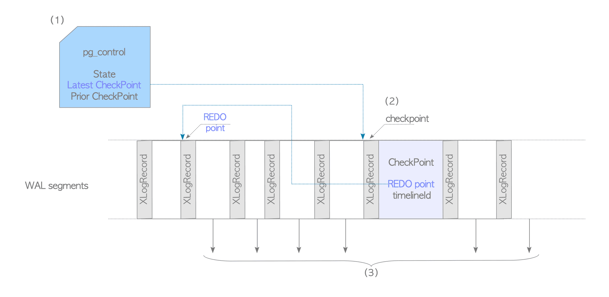
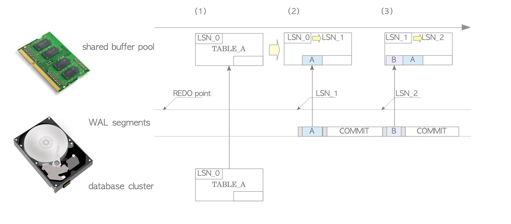
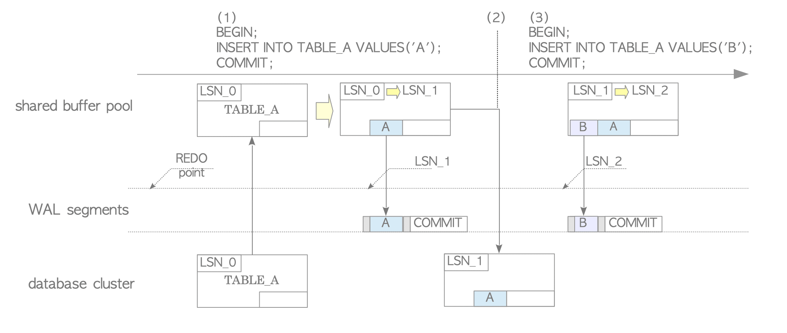
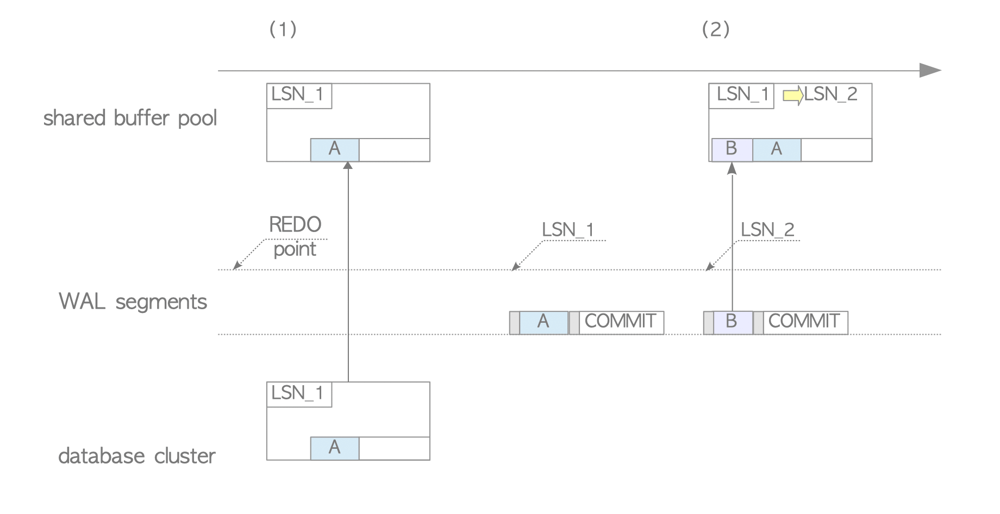

## 数据库的恢复

PostgreSQL的恢复功能基于REDO日志实现。如果数据库服务器无法工作，PostgreSQL通过从REDO点依序重放WAL段文件中的XLOG记录来恢复数据库集群。

### 1. 启动恢复过程

 

1. PostgreSQL在启动时读取pg_control文件的所有项。如果state项是in production,PostgreSQL将进入恢复模式，因为这意味着数据库没有正常停止；而如果state项是shut down，它就会进入正常的启动模式。
2. PostgreSQL 从合适的 WAL 段文件中读取最近的检查点，该记录的位置写在pg_control 文件中，并从该检查点中获得REDO点。如果最新的检查点是无效的，PostgreSQL就会读取前一个检查点（在PostgreSQL 11.0中不会存储前一个检查点）。如果两个记录都不可读，它就会放弃自我恢复。
3. 使用合适的资源管理器按顺序读取并重放XLOG记录，从重做点开始，直到最新WAL段文件的最后位置。当遇到一条属于备份区块的XLOG记录时，无论其LSN如何，都会覆写相应表的页面。在其他情况下，只有当此记录的LSN大于相应页面的pd_lsn时，才会重放该（非备份区块的）XLOG记录。

### 2. 如何将数据库集簇恢复到崩溃时刻前的状态

数据库重启时会自动进入恢复模式，PostgreSQL会从REDO点开始，依序读取正确的WAL段文件并重放XLOG记录。将数据库恢复到崩溃时刻前的状态。

 

1. PostgreSQL从相关的WAL段文件中读取第1条INSERT语句的XLOG记录，并从硬盘上的数据库目录加载TABLE_A的页面到内存中的共享缓冲区中。
2. 在重放XLOG记录前，PostgreSQL会比较XLOG记录的LSN与相应页面的LSN。重放XLOG的规则如下
    1. 如果XLOG记录的LSN比页面的LSN大，XLOG记录中的数据部分就会被插入页面中，并将页面的LSN更新为XLOG记录的LSN。
    2. 如果XLOG记录的LSN比页面的LSN小，那么不用做任何事情，直接读取后续的WAL数据即可。
3. PostgreSQL按照同样的方式重放其余的XLOG记录。

PostgreSQL可以通过按时间顺序重放写在WAL段文件中的XLOG记录来自我恢复，因此，PostgreSQL的XLOG记录显然是一种REDO日志。PostgreSQL不支持UNDO日志。

### 3. LSN的比较

非备份区块的LSN和相应页面的pd_lsn的比较

 

1. PostgreSQL将一条元组插入表A，并将一条XLOG记录写入LSN_1。
2. 后台写入进程将表A的页面写入存储。此时，此页面的pd_lsn为LSN_1。
3. PostgreSQL在表A中插入一条新元组，并在LSN_2处写入一条XLOG记录。修改后的页面尚未写入存储。

表A的页面已经被一次性写入存储中。使用immediate模式关闭数据库，然后启动数据库。

 

1. PostgreSQL加载第一条XLOG记录和TABLE_A的页面，但不重放它，因为该记录的LSN不大于表A的LSN（两个值都是LSN_1）,没有重放该记录的必要性。
2. 接下来，PostgreSQL会重放第二条XLOG记录，因为该记录的LSN（LSN_2）大于当前TABLE_A的LSN（LSN_1）。

可以看出，如果非备份区块的重放顺序不正确，或者多次重放非备份区块，数据库集群将不再一致。简而言之，非备份区块的重做（重放）操作不是幂等的。因此，为了确保正确的重放顺序，非备份区块中的记录当且仅当其LSN大于相应页面的pd_lsn时，才执行重放。
另外，由于备份区块的重放操作是幂等的，不管其 LSN为何值，备份块都可以重放任意次。