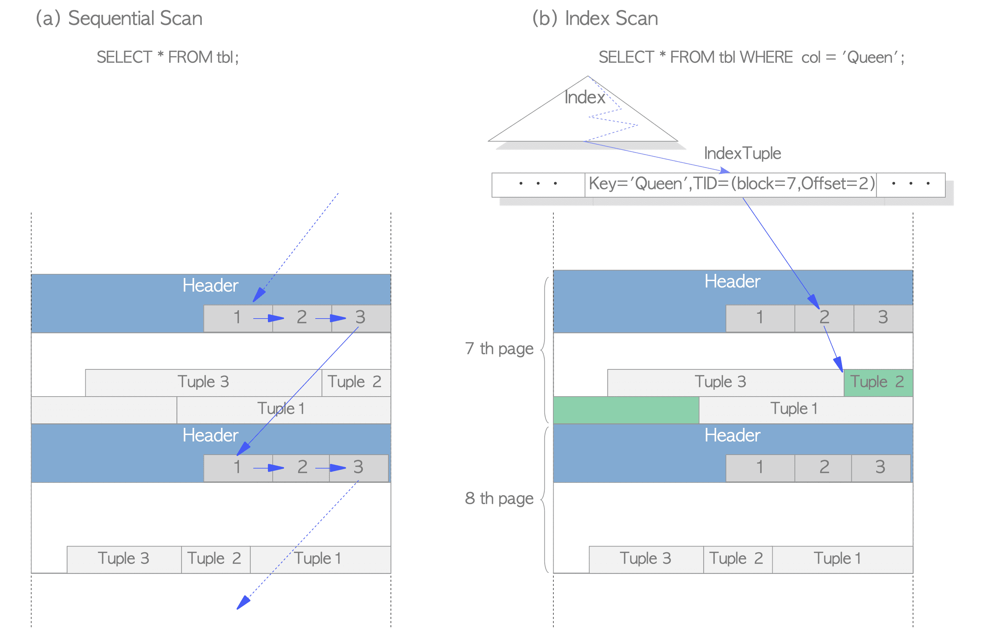
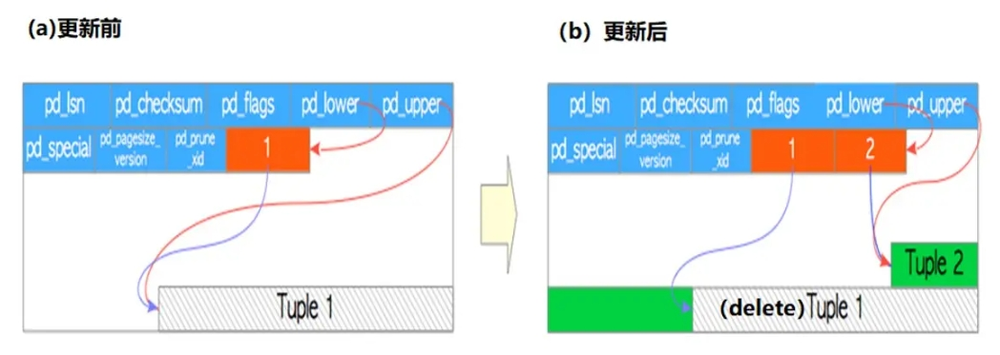

## 一、对象OID与数据文件对应关系

PG数据库的一张表或者索引对应一个数据文件。
作为数据库对象的表和索引在内部由各个oid管理，而这些数据文件则由变量relfilenode管理。
表和索引的relfilenode值开始时基本上(但并不总是)与相应的oid匹配。

```sql
postgres=# SELECT relname,oid,relfilenode FROM pg_class WHERE relname='tbl';
 relname |  oid  | relfilenode 
---------+-------+-------------
 tbl     | 16740 |       16740
(1 row)

postgres=# SELECT datname,oid FROM pg_database WHERE datname='postgres';
 datname  |  oid  
----------+-------
 postgres | 13593
(1 row)
```

相关表的数据文件路径

```bash
$ ls -l $PGDATA/base/13593/16740
-rw-------. 1 postgres postgres 0 Nov 16 09:51 /opt/software/postgresql/data/base/13593/16740
```

TRUNCATE、REINDEX、CLUSTER等操作会造成relfilenode号的改变，因为先删除原来的数据文件，再创建一个新的会更快。

使用内置函数`pg_relation_filepath`查看表的文件路径

```sql
postgres=# select pg_relation_filepath('tbl');
 pg_relation_filepath 
----------------------
 base/13593/16740
(1 row)
```

文件尺寸超过1GB后，新文件的产生规则：

```bash
$ cd $PGDATA
$ ls -la -h base/16384/19427*
-rw------- 1 data/base/16384/19427
-rw------- 1 data/base/16384/19427.1
```


## 二、相关联的其它数据文件

空闲空间地图和可见性地图('_fsm'和'_vm'):

```bash
$ cd $PGDATA
$ ls -1 base/13593/16740*
base/13593/16740
base/13593/16740_fsm
base/13593/16740_vm
```

- 当insert操作时空闲空间文件用来查看哪些数据块有空闲空间存放新行
- 当进行vacuum操作时可见性地图文件用来提高操作的效率
- 相关的三类文件在内部称为每个关系的分岔(fork)；数据文件的fork号为0、空闲空间文件fork号为1，可见性地图文件的fork号为2

## 三、数据库内部结构


数据文件（堆表、索引，也包括空闲空间映射和可见性映射）内部被划分为固定长度的页，或者叫区块，大小默认为8192B（8KB）。
每个文件中的页从0开始按顺序编号，这些数字称为区块号。如果文件已填满，PostgreSQL就通过在文件末尾追加一个新的空页来增加文件长度。
页面内部的布局取决于数据文件的类型。

表的页面包含了三种类型的数据：

1. 首部数据：页面的起始位置，大小为24B，包含关于页面的元数据。
 - pd_lsn：本页面最近一次变更所写入的XLOG记录对应的LSN。它是一个8B无符号整数。
 - pd_checksum：本页面的校验和值。（在9.3或更高版本中才有此变量，早期版本中该字段用于存储页面的时间线标识。）
 - pd_lower、pd_upper：pd_lower指向行指针的末尾，pd_upper指向最新堆元组的起始位置。
 - pd_special：在索引页中会用到该字段，在堆表页中它指向页尾。（在索引页中它指向特殊空间的起始位置，特殊空间是仅由索引使用的特殊数据区域，包含特定的数据，具体内容依索引的类型而定，如B树、GiST、GiN等。）
 - papagesize_version：页面的大小，以及页面布局的版本号
 - db_prune_xid：本页面中可以修剪的最老的元组中的XID

2. 行指针：每个行指针占4B，保存着指向堆元组的指针。它们也被称为项目指针。行指针形成一个简单的数组，扮演了元组索引的角色。每个索引项从1开始依次编号，称为偏移号。当向页面中添加新元组时，一个相应的新行指针也会被放入数组中，并指向新添加的元组。
3. 堆元组：即数据记录本身。它们从页面底部开始依序堆叠。

### 1. 插入数据


假设有一个表仅由一个页面组成，且该页面只包含一个堆元组。此页面的pd_lower指向第一个行指针，而该行指针和pd_upper都指向第一个堆元组。
当写入第二个元组时，它会被放在第一个元组之后。第二个行指针写入到第一个行指针的后面，并指向第二个元组。pd_lower 更改为指向第二个行指针，pd_upper更改为指向第二个堆元组。页面内的首部数据（例如pd_lsn、pg_checksum和pg_flag）也会被改写为适当的值

### 2.读取数据



1. 顺序扫描：通过扫描每一页中的行指针，依序读取所有页面中的所有元组。
2. B树索引扫描：索引文件包含索引元组，索引元组由一个键值对组成，键为被索引的列值，值为目标堆元组的TID。进行索引查询时，首先使用键进行查找，如果找到了对应的索引元组，PostgreSQL就会根据相应值中的TID来读取对应的堆元组。

### 3.更新表


update操作时，数据库的操作过程是先delete后insert，被删除的行空间不会立刻释放，vacuum操作时会释放。