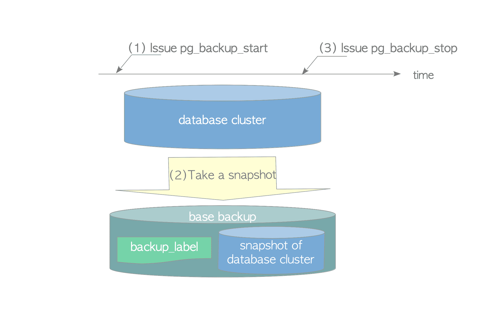

## 一、pg_basebackup

### 1. 备份原理

pg_basebackup工具自动执行pg_start_backup()和pg_stop_backup()函数，而且备份速度比手动备份更快。

#### 1. 备份前提

数据库处于归档模式

#### 2. 备份方式

1. 产生压缩的tar包：`pg_basebackup -D backup.tar -Ft -z -P`
2. 产生与源文件一样的格式：`pg_basebackup -D backup -Fp -P`，此备份方式块，但是不节省空间

#### 3. 备份过程

1. Issue the pg_start_backup command

    1. Force into the full-page write mode

    2. Switch to the current WAL segment file

    3. Do checkpoint

    4. Creat a backup_label file

        backup_label与base目录同级，包含备份的基本信息

        ```bash
        CHECKPOINT LOCATION – 记录创建的检查点的LSN位置
        START WAL LOCATION – 与流复制一起使用，处于复制模式的备服务器在初始启动时读取一次该值
        BACKUP METHOD – 基础备份的方法，值为'pg_start_backup'或'pg_basebackup'
        BACKUP FROM – 显示此备份是从主备份的还是从备备份的
        START TIME – pg_start_backup执行时的时间戳
        LABEL – pg_start_backup时指定的标签.
        START TIMELINE – 备份开始的时间线，在pg11中引入，用来进行健全性检查.
        ```

2. Take a snapshot of the database cluster with the archiving command you want to use

3. Issue the pg_stop_backup command

    1. Reset to *non-full-page writes* mode if it has been forcibly changed by the *pg_start_backup*.
    2. Write a XLOG record of backup end.
    3. Switch the WAL segment file.
    4. Create a backup history file – This file contains the contents of the backup_label file and the timestamp that the *pg_stop_backup* has been executed.
    5. Delete the backup_label file – The backup_label file is required for recovery from the base backup and once copied, it is not necessary in the original database cluster.

  

### 2. 用`pg_start_backup()`和`pg_stop_backup()`备份

确认开启归档

```bash
postgres@ubuntu:~$ grep -E "^archive|^restore" $PGDATA/postgresql.conf
archive_mode = on		# enables archiving; off, on, or always
archive_command = 'test ! -f /home/postgres/archive/%f && cp %p /home/postgres/archive/%f'
restore_command = 'cp /home/postgres/archive/%f %p'
```

调用`pg_start_backup()`开始备份

```sql
postgres=# select pg_start_backup('backup1');
 pg_start_backup 
-----------------
 0/2000028
(1 row)
```

此时$PGDATA目录下生成一个backup_label文件

```bash
postgres@ubuntu:~$ cat $PGDATA/backup_label
START WAL LOCATION: 0/2000028 (file 000000010000000000000002)
CHECKPOINT LOCATION: 0/2000060
BACKUP METHOD: pg_start_backup
BACKUP FROM: master
START TIME: 2023-01-30 22:27:14 CST
LABEL: backup1
START TIMELINE: 1
```

调用`pg_stop_backup()`结束备份

````sql
postgres=# select pg_stop_backup();
NOTICE:  all required WAL segments have been archived
 pg_stop_backup 
----------------
 0/2000138
(1 row)
````

此时，backup_label文件被删除

```bash
postgres@ubuntu:~$ ls  $PGDATA/backup_label
ls: cannot access '/opt/software/postgresql/12.13/data/backup_label': No such file or directory
```

在$PGDATA/pg_wal/新生成一个`*.backup`的文件

```bash
postgres@ubuntu:~$ ls -1 $PGDATA/pg_wal/
000000010000000000000002
000000010000000000000002.00000028.backup
000000010000000000000003
archive_status
postgres@ubuntu:~$ cat $PGDATA/pg_wal/000000010000000000000002.00000028.backup
START WAL LOCATION: 0/2000028 (file 000000010000000000000002)
STOP WAL LOCATION: 0/2000138 (file 000000010000000000000002)
CHECKPOINT LOCATION: 0/2000060
BACKUP METHOD: pg_start_backup
BACKUP FROM: master
START TIME: 2023-01-30 22:27:14 CST
LABEL: backup1
START TIMELINE: 1
STOP TIME: 2023-01-30 22:28:04 CST
STOP TIMELINE: 1
```

wal日志归档在`/home/postgres/archive`目录下

```bash
postgres@ubuntu:~$ ls -1 /home/postgres/archive
000000010000000000000002
000000010000000000000002.00000028.backup
```

### 3. 用`pg_basebackup`备份

```bash
postgres@ubuntu:~$ pg_basebackup -D backup.tar -Ft -z -P
23653/23653 kB (100%), 1/1 tablespace
postgres@ubuntu:~$ ls -1 backup.tar/
base.tar.gz
pg_wal.tar.gz
```

### 4. 恢复数据库

停止数据库

```bash
postgres@ubuntu:~$ pg_ctl stop
waiting for server to shut down.... done
server stopped
```

删除$DATA/下数据

```bash
postgres@ubuntu:~$ rm -rf $PGDATA/*
```

创建空的recovery.signal文件，告诉数据库需要recovery

```bash
postgres@ubuntu:~$ touch $PGDATA/recovery.signal
```

恢复数据

```bash
postgres@ubuntu:~$ tar xf backup.tar/base.tar.gz -C $PGDATA
postgres@ubuntu:~$ tar xf backup.tar/pg_wal.tar.gz -C $PGDATA
```

启动数据库

```bash
postgres@ubuntu:~$ pg_ctl start -D $PGDATA -l logfile
waiting for server to start.... done
server started
```

### 5. 时间线

时间线用于区分原始数据库和恢复生成的数据库。

#### 5.1 timelineid

每一个时间线都会有一个相应的timelineid，每个数据库集簇都会被指定一个时间线标识。由initdb命令创建的原始数据库，其时间线标识为1。每当数据库集簇恢复时，时间线标识都会增加1。例如，在上面的例子中，从原始备份中恢复得到的数据库，其时间线标识为2。

 

#### 5.2 histroy

恢复完成后，在生成timeline为00000002的历史文件

```bash
postgres@ubuntu:~$ cat $PGDATA/pg_wal/00000002.history
1	0/6000000	no recovery target specified
# 数据库（时间线标识为2）基于时间线标识为1的基础备份，
# 通过重放检查点日志，恢复至0/6000000的位置
```

历史文件包含了三部分：

- timelineId – timelineId of the archive logs used to recover.
- LSN – LSN location where the WAL segment switches happened.
- reason – human-readable explanation of why the timeline was changed.


> recovery_target = 'immediate'：指定恢复应该在达到一个一致性状态后尽快结束，在从一个在线备份恢复时，这意味着备份结束的那个点。


