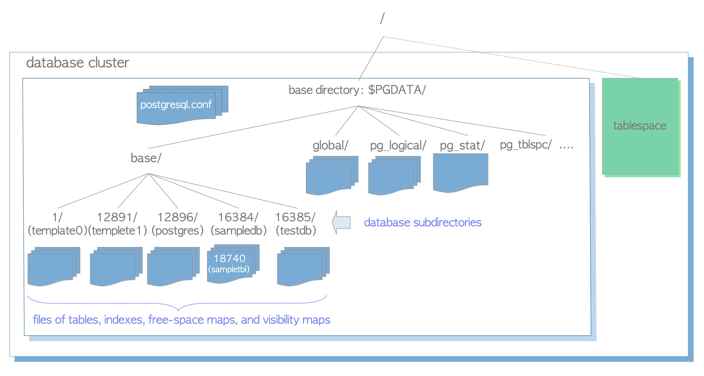
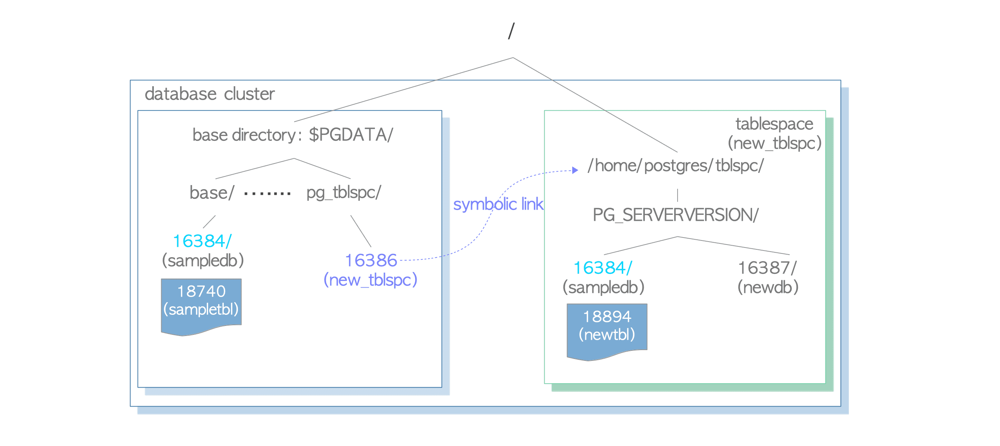
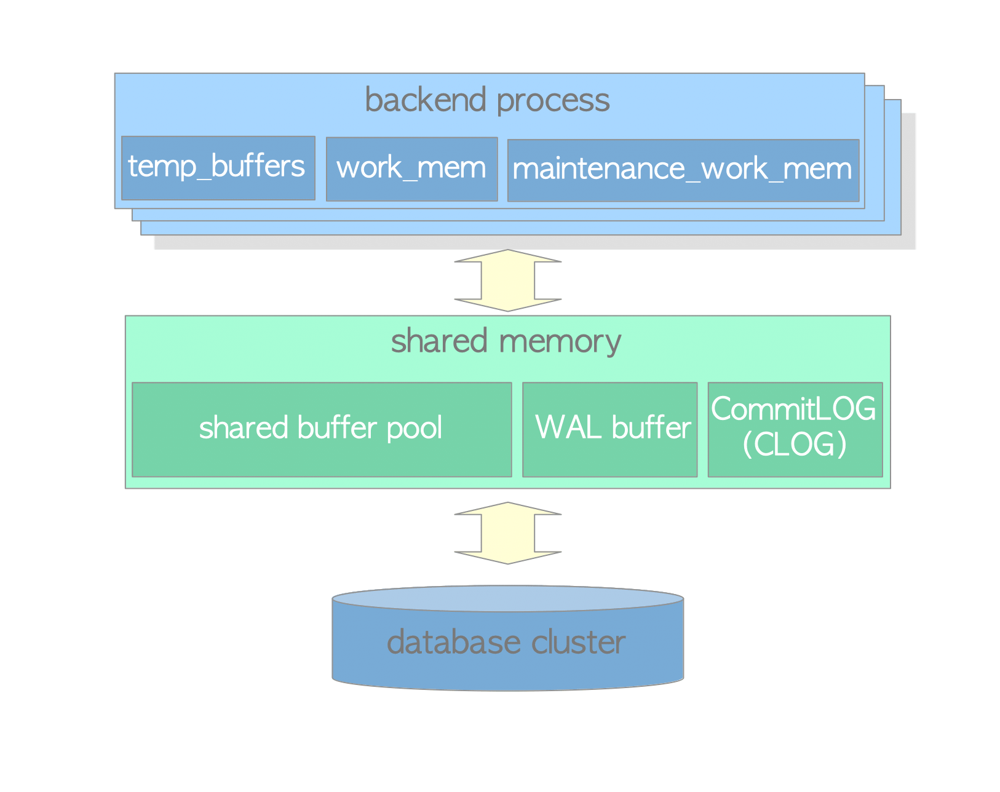

## 一、物理结构

 

`$PGDATA`目录结构

```bash
$ ls -1 $PGDATA
PG_VERSION            # 包含PostgreSQL主版本号的文件
postgresql.auto.conf  # 一个用于存储由ALTER SYSTEM 设置的配置参数的文件
postgresql.conf       # 参数配置
postmaster.opts       # 一个记录服务器最后一次启动时使用的命令行参数的文件
postmaster.pid        # 一个锁文件，记录着当前的 postmaster 进程ID（PID）、集簇数据目录路径、
                      # postmaster启动时间戳、端口号、Unix域套接字目录路径（Windows上为空）、
                      # 第一个可用的listen_address（IP地址或者*，或者为空表示不在TCP上监听）
                      # 以及共享内存段ID（服务器关闭后该文件不存在）
pg_hba.conf           # 客户端认证配置
pg_ident.conf         # 用户名映射配置
base                  # 包含每个数据库对应的子目录的目录
global                # 包含集簇范围的表的子目录，比如pg_database
pg_commit_ts          # 包含事务提交时间戳数据的子目录
pg_dynshmem           # 包含被动态共享内存子系统所使用的文件的子目录
pg_logical            # 包含用于逻辑复制的状态数据的子目录
pg_multixact          # 包含多事务（multi-transaction）状态数据的子目录（用于共享的行锁）
pg_notify             # 包含LISTEN/NOTIFY状态数据的子目录
pg_replslot           # 包含复制槽数据的子目录
pg_serial             # 包含已提交的可序列化事务信息的子目录
pg_snapshots          # 包含导出的快照的子目录
pg_stat               # 包含用于统计子系统的永久文件的子目录
pg_stat_tmp           # 包含用于统计信息子系统的临时文件的子目录
pg_tblspc             # 包含指向表空间的符号链接的子目录
pg_twophase           # 包含用于预备事务状态文件的子目录
pg_wal                # 包含 WAL （预写日志）文件的子目录
pg_xact               # 包含事务提交状态数据的子目录
```

### 1. 数据库结构

一个数据库与base子目录下的一个子目录对应，且该子目录的名称与相应数据库的oid相同。例如，当数据库postgres的oid为13593时，它对应的子目录名称就是13593。

```bash
[postgres@pg1 data]$ ls base/
1  13592  13593
[postgres@pg1 data]$ psql
psql (12.13)
Type "help" for help.

postgres=# select datname,oid from pg_database;
  datname  |  oid  
-----------+-------
 postgres  | 13593
 template1 |     1
 template0 | 13592
(3 rows)
```

### 2. 表和索引结构

在数据库内部，表和索引作为数据库对象是通过oid来管理的，而这些数据文件由变量relfilenode管理。表和索引的relfilenode值通常与其oid一致。

```sql
postgres=# create table tbl (id int);
CREATE TABLE
postgres=# SELECT relname, oid, relfilenode FROM pg_class WHERE relname = 'tbl';
 relname |  oid  | relfilenode 
---------+-------+-------------
 tbl     | 16384 |       16384
(1 row)
```

表和索引的relfilenode值会被一些命令（例如TRUNCATE、REINDEX、CLUSTER）所改变。例如对表tbl执行TRUNCATE命令，PostgreSQL会为表分配一个新的relfilenode（16387），删除旧的数据文件（16384），并创建一个新的数据文件（16387）。

```sql
postgres=# TRUNCATE tbl;
TRUNCATE TABLE
postgres=# SELECT relname, oid, relfilenode FROM pg_class WHERE relname = 'tbl';
 relname |  oid  | relfilenode 
---------+-------+-------------
 tbl     | 16384 |       16387
(1 row)
```

使用函数pg_relation_filepath能够根据oid或名称返回关系对应的文件路径。

```sql
postgres=# SELECT pg_relation_filepath('tbl');
 pg_relation_filepath 
----------------------
 base/13593/16387
(1 row)
```

当表和索引的文件大小超过1GB时，PostgreSQL会创建并使用一个名为relfilenode.1的新文件。如果新文件也填满了，则会创建下一个名为relfilenode.2的新文件，以此类推。

### 3. 表空间

 

1. PostgresQL中的表空间是基本目录之外的附加数据区域
2. 初始化数据库后默认的表空间pg_default、pg_global
3. pg_global表空间的物理文件位置在数据目录的global目录中，它用来保存系统表。
4. pg_default表空间的物理文件位置在数据目录的base子目录中，是templateo和template1数据库的默认表空间。
5. 创建数据库时，默认从template1数据库进行克隆，因此除非特别指定了新建数据库的表空间，否则默认使用template1使用的表空间，即pg_default表空间。

执行`CREATE TABLESPACE`语句会在指定的目录下创建表空间。在该目录下还会创建版本特定的子目录。版本特定的命名方式为：`PG_'Major version'_'Catalogue version number'`

```bash
$ mkdir -p /home/postgres/tblspc
$ psql
psql (12.13)
Type "help" for help.

postgres=# CREATE TABLESPACE new_tblspc LOCATION '/home/postgres/tblspc';
CREATE TABLESPACE
postgres=# \q
$ ls /home/postgres/tblspc
PG_12_201909212
```

表空间目录通过pg_tblspc子目录中的符号链接寻址，链接名称与表空间的oid值相同。

```sql
postgres=# select oid,spcname from pg_tablespace;
  oid  |  spcname   
-------+------------
  1663 | pg_default
  1664 | pg_global
 16390 | new_tblspc
(3 rows)
$ ls -l $PGDATA/pg_tblspc
total 0
lrwxrwxrwx. 1 postgres postgres 21 Nov 15 22:48 16390 -> /home/postgres/tblspc
```

#### 3.1  表空间下创建新库

如果在该表空间下创建新的数据库（oid为16387），则会在版本特定的子目录下创建相应的目录。

```bash
[postgres@pg1 ~]$ psql
psql (12.13)
Type "help" for help.

postgres=# CREATE DATABASE newdb TABLESPACE new_tblspc;
$ ls -l /home/postgres/tblspc/PG_12_201909212/
total 12
drwx------. 2 postgres postgres 8192 Nov 15 22:54 16391

```

#### 3.3 表空间下创建新表

如果在该表空间内创建一个新表，但新表所属的数据库却创建在基础目录下，那么 PG 会首先在版本特定的子目录下创建名称与现有数据库oid相同的新目录，然后将新表文件放置在刚创建的目录下。

```sql
postgres=# CREATE TABLE newtbl(id int) TABLESPACE new_tblspc;
CREATE TABLE
postgres=# SELECT pg_relation_filepath('newtbl');
            pg_relation_filepath             
---------------------------------------------
 pg_tblspc/16390/PG_12_201909212/13593/16392
```


## 二、进程结构

 

```bash
$ ps -u postgres -o pid,ppid,cmd --forest
   PID   PPID CMD
 17655  17654 -bash
 17969  17655  \_ ps -u postgres -o pid,ppid,cmd --forest
 17721      1 /opt/software/postgresql/12.13/bin/postgres
 17723  17721  \_ postgres: checkpointer   
 17724  17721  \_ postgres: background writer   
 17725  17721  \_ postgres: walwriter   
 17726  17721  \_ postgres: autovacuum launcher   
 17727  17721  \_ postgres: stats collector   
 17728  17721  \_ postgres: logical replication launcher 
```

采用多进程架构，包含下列进程：

1. Postgres服务器进程（postgres server process）是所有数据库集簇管理进程的父进程。
2. 每个后端进程（backend process）负责处理客户端发出的查询和语句。
3. 各种后台进程（background process）负责执行各种数据库管理任务（例如清理过程与存档过程）。
4. 各种复制相关进程（replication associated process）负责流复制。
5. 后台工作进程（background worker process）在9.3版本中被引入，它能执行任意由用户实现的处理逻辑。

### 1. Postgres服务器进程

1. postgres服务器进程是PostgreSQL服务器中所有进程的父进程，在早期版本中被称为“postmaster”。
2. 执行pg_ctl启动一个postgres服务器进程。它会在内存中分配共享内存区域。
3. 一个postgres服务器进程只会监听一个网络端口，默认端口为5432。

### 2. 后端进程

1. 每个后端进程（也称为“postgres”）由 postgres 服务器进程启动，并处理连接另一侧的客户端发出的所有查询。

2. PostgreSQL允许多个客户端同时连接，配置参数max_connections用于控制最大客户端连接数（默认为100）。

### 3. 后台进程

| 进程                        | 描述                                                         |
| --------------------------- | ------------------------------------------------------------ |
| background writer           | 本进程负责将共享缓冲池中的脏页逐渐刷入持久化存储中（例如，HDD、SSD） |
| checkpointer                | 在9.2及更高版本中，该进程负责处理检查点                      |
| autovacuum launcher         | 周期性地启动自动清理工作进程，更准确地说，它向postgres服务器请求创建白动清理工作进程 |
| WAL writer                  | 本进程周期性地将WAL缓冲区中的WAL数据刷入持久存储中           |
| statistics collector        | 本进程负责收集统计信息，用于诸如pg_stat_activity、pg_stat_database等系统视图 |
| logging collector （logger) | 本进程负责将错误消息写入日志文件                             |
| archiver                    | 本进程负责将日志归档                                         |


## 三、逻辑结构

  

## 四、内存结构

  

PostgreSQL的内存架构可以分为两个部分：

1. 本地内存区域——由每个后端进程分配，供自己使用，用于查询处理。
2. 共享内存区域——供PostgreSQL服务器的所有进程使用。

### 1. 本地内存区

| 子区域               | 描述                                                         |
| -------------------- | ------------------------------------------------------------ |
| work_mem             | 执行器在执行ORDER BY和DISTINCT时使用该区域对元组做排序，以及存储归并连接和散列连接中的连接表 |
| maintenance_work mem | 某些类型的维护操作使用该区域（例如VACUUM、REINDEX）          |
| temp_buffers         | 执行器使用此区域存储临时表                                   |

### 2. 共享内存区

| 子区域             | 描述                                                         |
| ------------------ | ------------------------------------------------------------ |
| shared buffer pool | PostgreSQL将表和索引中的页面从持久存储加载至此，并直接操作它们 |
| WAL buffer         | 为确保服务故障不会导致任何数据丢失，PostgreSQL实现了WAL机制。WAL数据（也称为XLOG记录）是PostgreSQL中的事务日志：WAL缓冲区是WAL数据在写入持久存储之前的缓冲区 |
| commit log         | 提交日志（CommitLog，CLOG）为并发控制（CC）机制保存了所需的所有事务状态（例如进行中、已提交、已中止等） |

除了上面这些，PostgreSQL还分配了以下几个区域：

- 用于访问控制机制的子区域（例如信号量、轻量级锁、共享和排他锁等）。
- 各种后台进程使用的子区域，例如checkpointer和autovacuum。
- 用于事务处理的子区域，例如保存点与两阶段提交（2PC）。