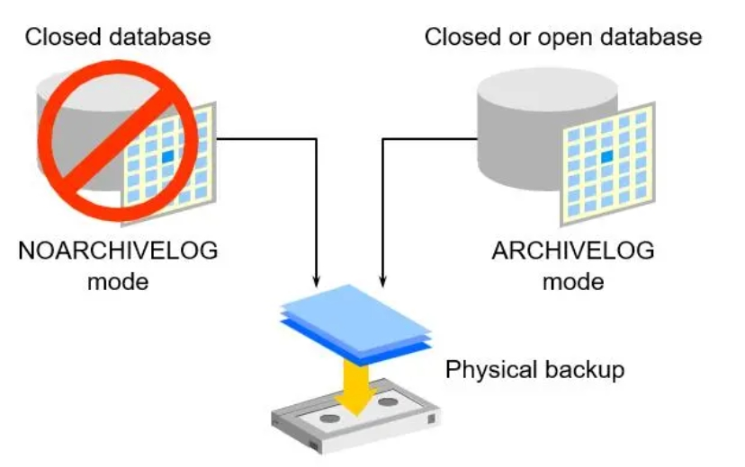

## 术语

- 全库备份
  - 目标数据库处于打开或者关闭状态
  - 备份$PGDATA下所有的数据文件
- 部分备份
  - 备份除了pg_global的其它表空间
- 一致性备份
- 不一致性备份


## 备份工具

使用操作系统命令对数据库文件进行备份和恢复

使用pg_basebackup对数据库文件进行备份

使用pg_rman对数据库文件进行备份和恢复


## 备份模式



### 一致性备份(数据库关闭)

备份$PGDATA目录下所有文件


一致性全库备份的好处

- 概念简单
- 易于执行
- 需要很少的操作员交互

执行一致性全库备份


### 数据库打开模式下备份


数据库打开模式下备份好处
- 保持高数据库可用性
- 支持不间断的业务运营

数据库打开模式下备份要求


连续归档是在WAL段切换时将WAL段文件复制到归档区域的功能，由archiver(后台)进程执行。其中，占位符%p是复制的WAL段，而%f是存档日志。

```sql
ALTER SYSTEM SET archive_command = 'cp %p /home/postgres/archives/%f';
ALTER SYSTEM SET archive_mod = on;
```


## 执行数据库打开模式下备份

pg_basebackup基本备份的标准过程如下所示：


(1) 执行pg_start_backup命令 
(2) 使用tar/cp命令对$PGDATA目录进行备份
(3) 执行pg_stop_backup命令


pg_basebackup工作原理：

pg_start_backup执行以下四个操作

1. Force into the full-page wirte mode.
2. Switch to the current WAL segment file (version 8.4 or later).
3. Do checkpoint.
4. Create a backup_label file:此文件创建于base目录的同一层，包含有关基本备份本身的基本信息，例如此检查点的检查点位置。

backup_label文件包含如下内容

- CHECKPOINT LOCATION –这是记录此命令创建的检查点的LSN位置。
- START WAL LOCATION –这不与PITR一起使用，而是与流式复制一起使用。它被命名为"START WAL LOCATION"，因为处于复制模式的备用服务器在初始启动时只读取一次该值。
- BACKUP METHOD–这是用于进行此基础备份的方法。(pg_start_backup或pg_basebackup。)
- BACKUP FROM –这显示此备份是从主备份还是从备用备份。
- START TIME –这是执行pg_start_backup时的时间戳。
- LABEL –这是在pg_start_backup中指定的标签。
- START TIMELINE –这是备份开始的时间线。这是为了进行健全性检查，并已在版本11中引入。

pg_stop_backup

1. 如果pg_start_backup强制更改了非整页写入模式，则将其重置为非整页写入模式。
2. 写一个备份结束的XLOG记录。
3. 切换WAL日志。
4. 创建备份历史文件–此文件包含备份标签文件的内容和执行pg_stop_backup的时间戳。
5. 删除备份标签文件–备份标签文件是从基本备份恢复所必需的，一旦复制，就不必在原始数据库群集中。


## 执行pg_basebackup备份示例

产生压缩的tar包，-Ft参数指定：

```bash
pg_basebackup -D bk1 -Ft -z -P
```
此备份花的时间比较长，但是节省空间。支持表空间文件存放在其它目录下。

产生跟源文件一样的格式，即原样格式，-Fp参数指定：

```bash
pg_basebackup -D bk2 -Fp -P
```

此备份方式很快，但是不节省空间。如果有表空间路径放在其它目录下，则备份失败。


## 执行用户管理全库备份示例

数据库中执行开始备份函数：

```sql
select pg_start_backup('full');
```

使用tar命令进行备份：

```bash
cd $PGATA
tar -zcf /backup/data.tar.gz .
```

数据库中执行结束备份函数：

```sql
select pg_stop_backup();
```


## 执行表空间备份示例

数据库中执行开始备份函数：

```sql
select pg_start_backup('tbs');
```

使用tar命令进行备份(备份pg_default表空间所在的目录)：

```bash
cd $PGATA
tar -zcf /backup/base.tar.gz base
cp backup_lable /backup
```

数据库中执行结束备份函数：

```sql
select pg_stop_backup();
```


## 执行只读数据库备份示例

把某个数据库变成只读：

```sql
ALTER DATABASE new_db1 set default_transaction_read_only=on;
```

使用tar/cp命令进行备份(备份new_db1所在的目录)：

```bash
cd $PGATA/base
tar -zcf /backup/90195.tar.gz 90195
```