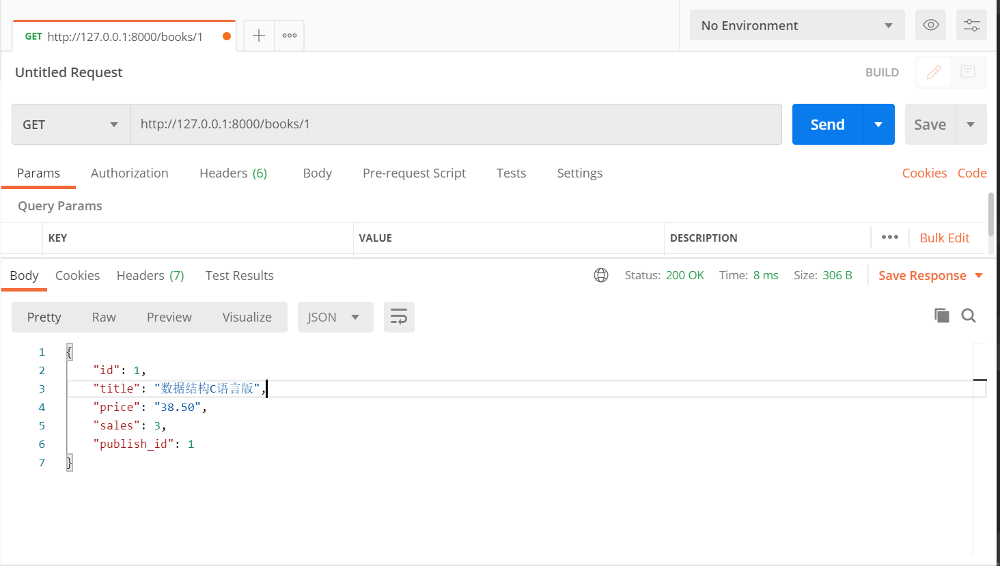
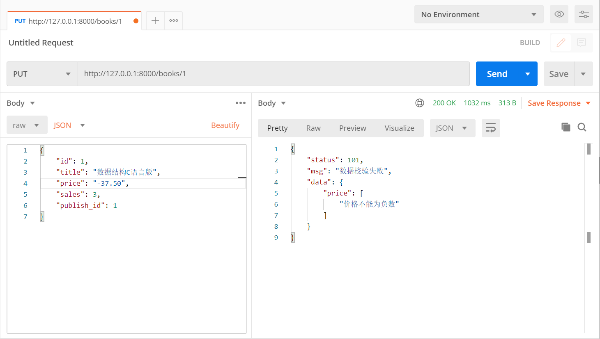
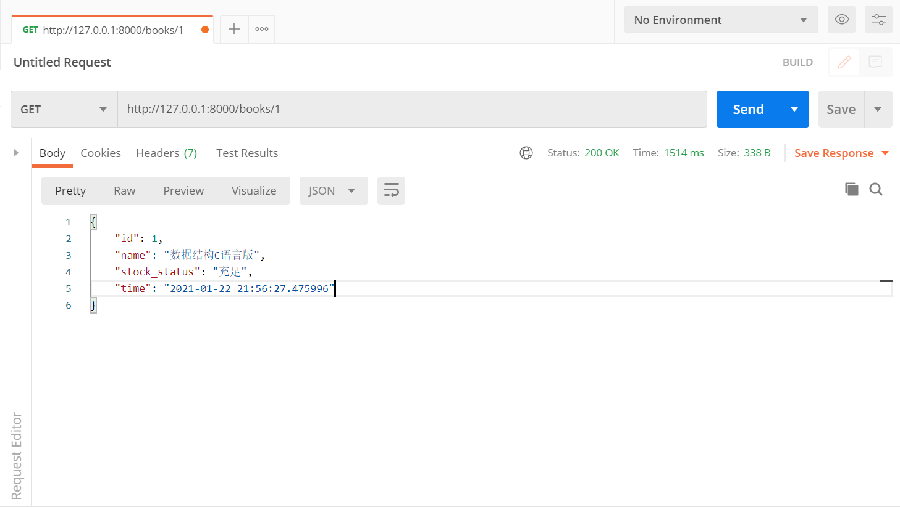
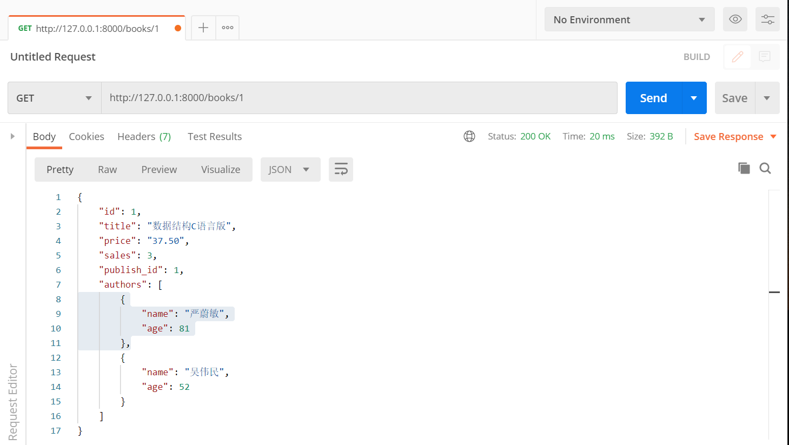

# 序列化（Serializers）

## 一、序列化

1. 序列化：序列化器会把模型对象转换成字典,经过`response`以后变成`json`字符串

2. 反序列化：把客户端发送过来的数据经过`request`以后变成字典，序列化器可以把字典转成模型。

## 二、基本使用

### 1. 查

**使用流程：**

1. 新建一个`py`文件（专门用来写序列化类）写一个序列化的类，继承`Serializer`。在类中写要序列化的字段（想序列化哪个字段，就在类中写哪个字段）。
2. 在视图类中使用：导入序列化类然后实例化得到序列化类的对象，并且把要序列化的对象传入。
3. `序列化类的对象.data`可以得到一个字典
5. 把字典返回：如果不使用`rest_framework`的`Response`，就得使用`JsonResponse`

#### 1. 准备`models.py`

序列化`Serializers`是为了方便操作模型，先准备models。

```python
class Book(models.Model):
    title = models.CharField(max_length=32, verbose_name="书名")
    price = models.DecimalField(max_digits=8, decimal_places=2, verbose_name="价格")
    sales = models.IntegerField(verbose_name='销售量')

    publish = models.ForeignKey(to='Publish')
    authors = models.ManyToManyField(to='Author')


class Publish(models.Model):
    name = models.CharField(max_length=32, verbose_name="出版社名称")
    addr = models.CharField(max_length=64, verbose_name="通讯地址")


class Author(models.Model):
    name = models.CharField(max_length=32, verbose_name="作者姓名")
    age = models.IntegerField(verbose_name="年龄")

    author_detail = models.OneToOneField(to='AuthorDetail')


class AuthorDetail(models.Model):
    email = models.EmailField(verbose_name="邮箱")
    addr = models.CharField(max_length=32, verbose_name="通讯地址")
```

#### 2. 创建序列化的类

新建一个`serializers.py`

```python
from rest_framework import serializers


class BookSerializer(serializers.Serializer):
    # 写上要序列化的字段：serializers.字段类型()
    # 键的名字要和model.py中的一样
    id = serializers.IntegerField()
    title = serializers.CharField()
    price = serializers.DecimalField(max_digits=8, decimal_places=2)
    sales = serializers.IntegerField()
    publish_id = serializers.IntegerField()
```

#### 3. 在`views.py`写视图

需要继承`rest_framework`中的`APIView`。

```python
from django.shortcuts import render, HttpResponse

# Create your views here.
from rest_framework.views import APIView
from app.models import Book
from app.serializers import BookSerializer
from rest_framework.response import Response


class BookView(APIView):
	# 查询一条数据
    def get(self, request, pk):
        book = Book.objects.filter(id=pk).first()
        book_ser_obj = BookSerializer(book)  # 实例化，传入要序列化的对象

        return Response(book_ser_obj.data)  # 返回序列化以后的字典

```

#### 4. 在`urls.py`注册路由

```python
from django.conf.urls import url
from django.contrib import admin
from app import views

urlpatterns = [
    url(r'^admin/', admin.site.urls),
    url(r'^books/(?P<pk>\d)', views.BookView.as_view()),
]

```

#### 5. 验证




### 2. 改

**使用流程：**

1. 写一个序列化的类，继承`Serializer`。在类中写要反序列化的字段。
2. 在视图类中使用：导入序列化类；实例化得到序列化类的对象，把要修改的对象和修改的数据传入。如：`book_ser_obj=BookSerializer(instance=book,data=request.data)`
3. 数据校验 `book_ser_obj.is_valid()`

   - 如果校验通过，就保存：`book_ser_obj.save()`
   - 如果校验不通过，自己写逻辑处理
4. 如果字段的校验规则不够，可以写钩子函数

   - 局部钩子：校验一个字段
   - 全局钩子：同时校验多个字段

#### 2.1 在视图类中写`put()`方法

```python
class BookView(APIView):
    ...
    def put(self, request, pk):
        # 定义一个返回的数据
        response_msg = {'status': 100, 'msg': '成功'}

        # 找到要修改的对象
        book = Book.objects.filter(id=pk).first()

        # 得到一个序列化类的对象
        # 需要传入的参数可以再父类中找到
        # class BaseSerializer(Field):
        #     def __init__(self, instance=None, data=empty, **kwargs):
        book_ser_obj = BookSerializer(instance=book, data=request.data)

        # 进行数据验证
        if book_ser_obj.is_valid():  # 返回True表示验证通过
            book_ser_obj.save()
            response_msg['data'] = book_ser_obj.data  # 字典格式
        else:
            response_msg['status'] = 101
            response_msg['msg'] = '数据校验失败'
            response_msg['data'] = book_ser_obj.errors

        return Response(response_msg)
```

当直接发送`PUT`请求时，会抛出异常

```bash
  File "D:\APP\python36\lib\site-packages\rest_framework\serializers.py", line 165, in update
    raise NotImplementedError('`update()` must be implemented.')   
```

在`serializers.py`中通过来`raise`抛出异常，要求我们重新`update()`方法。

```python
#  serializers.py
class BaseSerializer(Field):
    ...
    def update(self, instance, validated_data):
        raise NotImplementedError('`update()` must be implemented.')
```

#### 2.2 在`serializes.py`中重写`update()`方法

```python
class BookSerializer(serializers.Serializer):
    ...
   def update(self, instance, validated_data):
        # instance是book这个对象
        # validated_data是校验后的数据
        instance.title = validated_data.get('title')
        instance.price = validated_data.get('price')
        instance.sales = validated_data.get('sales')
        instance.publish_id = validated_data.get('publish_id')
        instance.save()  # book.save()   django 的orm提供的
        return instance
```

#### 2.3 数据校验的钩子函数

##### 2.3.1 局部钩子

```python
# serializers.py
from rest_framework import serializers
from rest_framework.serializers import ValidationError

class BookSerializer(serializers.Serializer):
	...
    # 局部钩子
    def validate_price(self, data):  # validate_字段名  接收一个参数
        # 如果价格小于0，就校验不通过
        print(type(data))  # <class 'str'>
        print(data)  # -200
        if float(data) > 0:
            return data
        else:
            # 校验失败，抛异常
            raise ValidationError('价格不能为负数')
```



##### 2.3.2 全局钩子

```python
from rest_framework import serializers
from rest_framework.serializers import ValidationError

class BookSerializer(serializers.Serializer):
	...
    # 全局钩子，校验多个字段
    def validate(self, validate_data):
        price = validate_data.get('price')
        sales = validate_data.get('sales')
        if price < 0 or sales < 0:
            raise ValidationError('字段不能为负数')
        else:
            return validate_data
```

### 3. 删

```python
# views.py
from rest_framework.response import Response

class BookView(APIView):

	...
    def delete(self,request,pk):
        response_msg = {'status': 100, 'msg': '成功'}
        ret = Book.objects.filter(pk=pk).delete()
        return Response(response_msg)
```

以上的三种方法在发送请求时，都需要在`books/`后加一个主键值。所以上述的三种方法可以公用同一个视图。但是对于查询所有数据和新增数据，`books/`后不需要加参数，需要新建一个视图类和`url`匹配规则来实现查询所有和新增数据的方法。

### 4. 查询所有

新增一个视图类

```python
class BooksView(APIView):
    def get(self, request):
        response_msg = {'status': 100, 'msg': '成功'}
        books = Book.objects.all()
        book_ser_obj = BookSerializer(books, many=True)  # 序列化多条,如果序列化一条，不需要写
        response_msg['data'] = book_ser_obj.data
        return Response(response_msg)
```

添加路由

```python
from django.conf.urls import url
from django.contrib import admin
from app import views

urlpatterns = [
    url(r'^admin/', admin.site.urls),
    url(r'^books/(?P<pk>\d)', views.BookView.as_view()),
    url(r'^books/', views.BooksView.as_view()),
]
```


### 5. 增

```python
class BooksView(APIView):
    # 新增
    def post(self, request):
        response_msg = {'status': 100, 'msg': '成功'}
        # 修改才有instance，新增没有instance，只有data
        book_ser_obj = BookSerializer(data=request.data)
        # 校验字段
        if book_ser_obj.is_valid():
            book_ser_obj.save()  # 需要从写create()
            response_msg['data'] = book_ser_obj.data
        else:
            response_msg['status'] = 102
            response_msg['msg'] = '数据校验失败'
            response_msg['data'] = book_ser_obj.errors
        return Response(response_msg)
```

直接访问同样会抛出异常，需要在序列化类中重写`create()`方法

```python
# serializers.py
from app.views import Book
class BookSerializer(serializers.Serializer):
    ...
    def create(self, validated_data):
        instance = Book.objects.create(**validated_data)
        return instance
```


## 三、`source`的使用

### 1. 修改序列化类中字段的名字

如果不想直接将model中字段的名字暴露，可以通过source来指定model中字段的名字，序列化类中的键可以用别的名字来代替。

```python
class BookSerializer(serializers.Serializer):
    id = serializers.IntegerField()
    # title = serializers.CharField()
    name = serializers.CharField(source='title')
    ...
```

### 2. 跨表

```python
class BookSerializer(serializers.Serializer):
	...
    publish = serializers.CharField(source='publish.name')  # 查询出出版社的名称
```

### 3. 执行model表中的方法

 source 如果是字段，会显示字段，如果是方法，会执行方法，不用加括号。 如在模型中定义一个方法，直接可以在在source指定执行 。

```python
# 在模型中加一个choices字段
class Book(models.Model):
    ...
    
    stock_status = models.IntegerField(choices=((0, '充足'), (1, "紧张"), (2, "无货")), verbose_name='库存状态', default=0)
    
    # 模型表中自己定义的方法
    def access_time(self):
        import datetime
        return datetime.datetime.now()
```

如果想在响应中显示这个字段对应的汉字，就可以使用source。

```python
class BookSerializer(serializers.Serializer):
	...
    stock_status = serializers.CharField(source='get_stock_status_display')
    time = serializers.CharField(source='access_time')
```



## 四、封装Response对象

上面的每一个方法中都写了一个`response_msg`。可以利用的面向对象的封装特性，把响应的消息封装到一个类中。

```python
# 1. 自定义MyResponse类
class MyResponse:
    def __init__(self):
        self.status = 100
        self.msg = '成功'

    @property
    def get_dict(self):
        return self.__dict__


class BooksView(APIView):

    def get(self, request):
        response = MyResponse()
        books = Book.objects.all()
        book_ser_obj = BookSerializer(books, many=True)  # 序列化多条,如果序列化一条，不需要写
        response.data = book_ser_obj.data
        return Response(response.get_dict)
```

## 五、`SerializerMethodField`

如果想要在序列化的字段中加入`authors`，直接加`authors = serializers.CharField()`返回的是`"authors": "app.Author.None"`。需要借助`SerializerMethodField`来返回其他字段。

```python
class BookSerializer(serializers.Serializer):
    ...
    # 需要有个配套方法，方法名叫get_字段名，返回值就是要显示的东西
    authors = serializers.SerializerMethodField()

    def get_authors(self, instance):
        # book对象
        authors = instance.authors.all()  # 取出所有作者
        res = []
        for author in authors:
            res.append({'name': author.name, 'age': author.age})
        return res
```





   

## 六、 模型类序列化器`ModelSerializer`

不需要重写`create()`和`update()`方法了，其他使用和上述一样。

### 1. 定义

```python
class BookModelSerializer(serializers.ModelSerializer):
    class Meta:
        model = Book  # 指明参照哪个模型类，对应上models.py中的模型
        fields = '__all__' # 指明为模型类的哪些字段生成
```

### 2.   指定序列化字段

#### 2.1  使用**fields**来明确字段，`__all__`表名包含所有字段，也可以写明具体哪些字段，如

```python
class BookModelSerializer(serializers.ModelSerializer):
    class Meta:
        model = Book
        fields = ('id', 'title','price')  # 只序列化指定的字段
```

#### 2.2  使用**exclude**排除字段 

```python
class BookModelSerializer(serializers.ModelSerializer):
    class Meta:
        model = Book
        exclude = ('name',) # fields和exclude只能写其中一个
```

#### 2.3  指明只读字段

```python
class BookModelSerializer(serializers.ModelSerializer):
    class Meta:
        model = Book
        fields = '__all__'
        read_only_fields=('name',)
```

#### 2.4 额外参数

```python
class BookModelSerializer(serializers.ModelSerializer):
    class Meta:
        model=Book 
        fields='__all__'
        extra_kwargs = {  # 类似于这种形式name=serializers.CharField(max_length=16,min_length=4)
            'price': {'write_only': True},
        }
```

