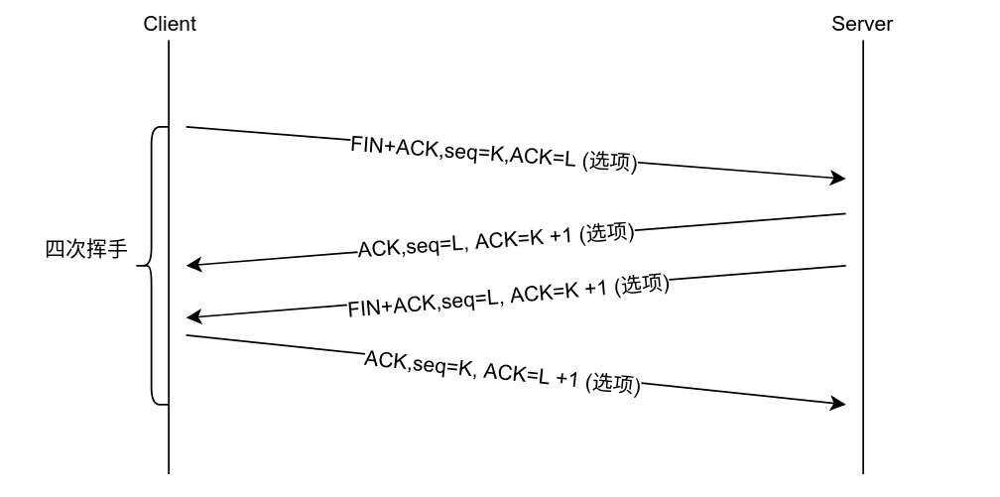
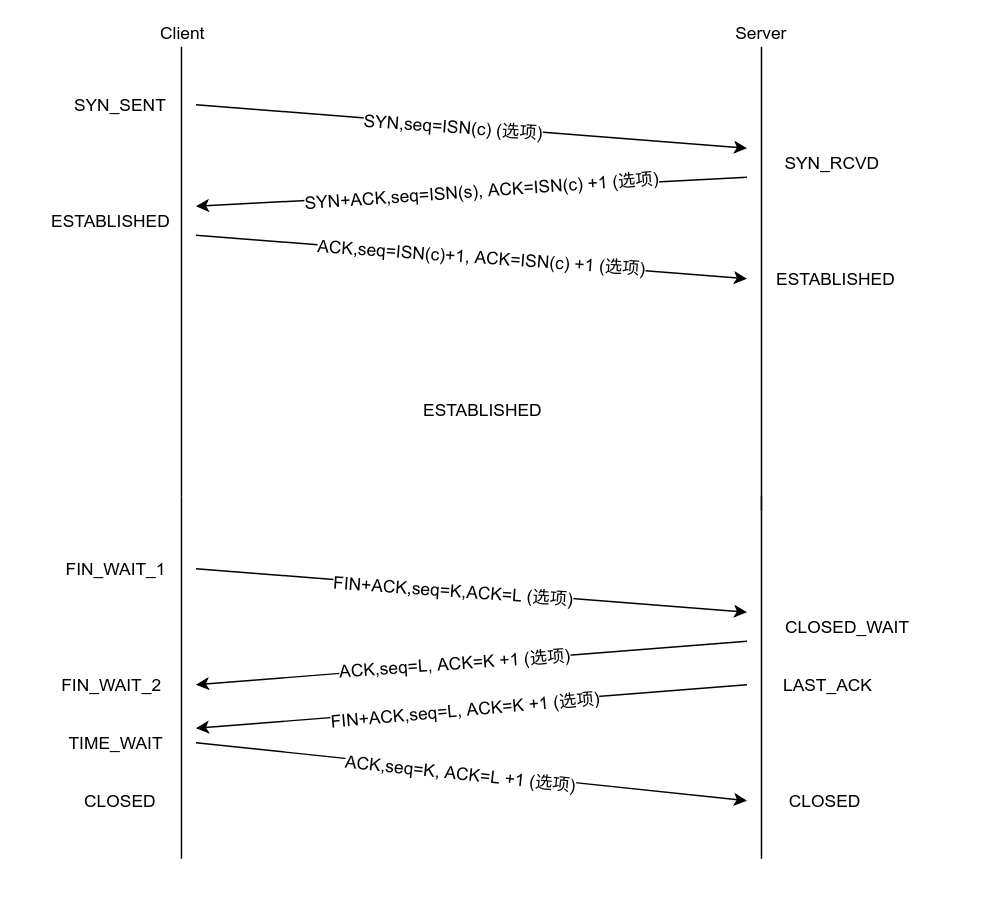

TCP基础知识与Linux内核参数调优


# 一、概念

1. 处理通信差错的方法：
	使用差错校正码
	重试重新发送，即自动重复请求（AutoARQ）
2. ACK(acknowledgment，确认号)：该确认号的发送方期待接收的下一个序列号，即最后被成功接收的数据字节的序列号+1
3. seq(sequence number，序列号)：标识了TCP发送端到TCP接收端的数据流的一个字节，该字节代表者该序列号报文段的数据中的第一个字节
4. TCP：面向连接的（使用TCP的两个应用必须在他们交换数据之前，通过相互联系来建立一个TCP连接）、可靠的字节流服务。
5. TCP连接是双向和对称的，数据可以在两个方向上平等的流动
6. socket（套接字）：一个IP地址和一个端口的组合
7. 连接标识：4元组(客户端IP、客户端端口、服务端IP、服务端端口)


# 二、TCP连接的建立与终止

1. TCP连接的构成：客户端IP、客户端端口、服务端IP、服务端端口
2. TCP连接的3个阶段：启动、数据传输、退出(关闭)
3. ISN(Initail Sequence Number，初始序列号)：在发送用于建立连接的SYN之前，通信双方会选择一个初始序列号，序列号会随着时间而改变，因此每一个连接拥有不同的初始序列号，[RFC0793]指出初始序列号是一个32位的计数器，该计数器的值每4毫秒+1。Linux是采用基于时钟的方案，并且针对每一个连接为时钟设置随机的偏移量，随机偏移量是在连接标识的基础上利用加密散列函数得到的，散列函数的输入每隔5分钟就会更改一次。生产的序列号随着时间的增加而增加。

## 1. 三次握手


1. 客户端发送一个SYN报文段，并指明自己想要连接的端口号和客户端初始序列号(ISN(c))
2. 服务器也发送自己的SYN报文段作为响应，并包含了它的初始序列号(ISN(s))，此外，为了确认客户端的SYN，服务端将其包含的ISN(c)数值+1后作为返回的ACK数值
3. 为了确认服务器的SYN，客户端将ISN(s)的数值+1后作为返回的ACK数值

##2. 数据传输

交互数据流-以ssh为例


## 3.四次挥手



1. 连接的主动关闭者发送一个FIN段指明接收者希望看到的自己当前的序列号(K)，FIN还包含了一个ACK段用于确认对方最后一次发来的数据(L)
2. 连接的被动关闭者将K的数值+1,最为响应的ACK，以表面它已经成功接收到主动关闭者发送的FIN。此时上层应用程序会被告知连接的另一端已经提出了关闭连接额请求，然后应用程序发起自己的关闭操作。接着被动关闭者将身份转变为主动关闭这，并发送自己的FIN，该报文段的序列号为L
3. 为了完成连接的关闭，最后发送的报文还应包含一个ACK用于确认上一个FIN。如果FIN丢失的，那么发送方极爱那个重新传输直到接收一个ACK确认为止。

注意：一般情况下，负责发起关闭连接的通常是客户端，但是在一些服务器(Web服务器)在对请求做出响应之后也会发起一个关闭操作。

实例：
```bash
$ curl http://192.168.1.60
hello
```

tcp抓包分析
```bash
[root@localhost ~]# tcpdump -i enp0s3 tcp port 80 -S
tcpdump: verbose output suppressed, use -v or -vv for full protocol decode
listening on enp0s3, link-type EN10MB (Ethernet), capture size 262144 bytes
# 三次握手第一步：客户端发起请求，序列号为129238614
11:33:44.910398 IP 192.168.1.41.54890 > 192.168.1.60.http: Flags [S], seq 129238614, win 29200, options [mss 1460,sackOK,TS val 2499218799 ecr 0,nop,wscale 7], length 0
# 三次握手第二步：服务端确认，确认号为129238615，同时发送的序列号为2856829331
11:33:44.910433 IP 192.168.1.60.http > 192.168.1.41.54890: Flags [S.], seq 2856829331, ack 129238615, win 28960, options [mss 1460,sackOK,TS val 4721674 ecr 2499218799,nop,wscale 7], length 0
#　三次握手第三步：客户端确认，确认号为2856829332
11:33:44.910530 IP 192.168.1.41.54890 > 192.168.1.60.http: Flags [.], ack 2856829332, win 229, options [nop,nop,TS val 2499218799 ecr 4721674], length 0
--------------------------------------数据传输----------------------------------------
# 客户端发起请求，请求的序号为129238615:129238691，共76字节，使用的是HTTP的GET方法
11:33:44.910542 IP 192.168.1.41.54890 > 192.168.1.60.http: Flags [P.], seq 129238615:129238691, ack 2856829332, win 229, options [nop,nop,TS val 2499218799 ecr 4721674], length 76: HTTP: GET / HTTP/1.1
# 服务器收到请求后发送一个确认帧
11:33:44.910559 IP 192.168.1.60.http > 192.168.1.41.54890: Flags [.], ack 129238691, win 227, options [nop,nop,TS val 4721674 ecr 2499218799], length 0
# 服务器向客户端传输数据
11:33:44.910695 IP 192.168.1.60.http > 192.168.1.41.54890: Flags [P.], seq 2856829332:2856829572, ack 129238691, win 227, options [nop,nop,TS val 4721674 ecr 2499218799], length 240: HTTP: HTTP/1.1 200 OK
# 客户端收到数据后向服务端确认
11:33:44.910766 IP 192.168.1.41.54890 > 192.168.1.60.http: Flags [.], ack 2856829572, win 237, options [nop,nop,TS val 2499218799 ecr 4721674], length 0
--------------------------------------数据传输----------------------------------------
# 客户端发起断开连接的请求，发送FIN，序列号为129238691，确认号为2856829572，为最后一次发来的数据
11:33:44.910814 IP 192.168.1.41.54890 > 192.168.1.60.http: Flags [F.], seq 129238691, ack 2856829572, win 237, options [nop,nop,TS val 2499218799 ecr 4721674], length 0
# 服务端确认(ACK)了客户端的序列号129238691+1=129238692，同时发送FIN，同时发送序列号2856829572
11:33:44.918483 IP 192.168.1.60.http > 192.168.1.41.54890: Flags [F.], seq 2856829572, ack 129238692, win 227, options [nop,nop,TS val 4721676 ecr 2499218799], length 0
# 客户端回复确认，确认号为服务端的序列号2856829572+1=2856829573
11:33:44.918565 IP 192.168.1.41.54890 > 192.168.1.60.http: Flags [.], ack 2856829573, win 237, options [nop,nop,TS val 2499218801 ecr 4721676], length 0
```

**问题：** 为什么tcpdump在四次挥手中只抓到三个步骤？

这里涉及到TCP的延时确认，在许多情况下，TCP并不对每个到来的数据包都返回ACK，利用TCP的累计ACK字段就能实现该功能，累积确认允许TCP延时一段时间发送ACK，以便将ACK和相同方向方向上需要传的数据结合发送。
在实验中使用curl命令时四次挥手过程只能抓到三个，使用浏览器的情况下，断开连接由服务器端发起，抓到四次挥手的全过程，如下所示：

```bash
# 1. 服务端发起断开连接的请求
12:04:58.068808 IP 192.168.1.60.http > 192.168.1.41.56736: Flags [F.], seq 79265592, ack 2919233145, win 235, options [nop,nop,TS val 6594833 ecr 2499670825], length 0
# 2. 客户端确认收到断开连接的请求
12:04:58.115367 IP 192.168.1.41.56736 > 192.168.1.60.http: Flags [.], ack 79265593, win 237, options [nop,nop,TS val 2499687101 ecr 6594833], length 0
# 3.  客户端发起断开连接的请求
12:04:58.123188 IP 192.168.1.41.56736 > 192.168.1.60.http: Flags [F.], seq 2919233145, ack 79265593, win 237, options [nop,nop,TS val 2499687102 ecr 6594833], length 0
# 4. 服务端确认收到断开连接的请求，TCP连接断开
12:04:58.123239 IP 192.168.1.60.http > 192.168.1.41.56736: Flags [.], ack 2919233146, win 235, options [nop,nop,TS val 6594887 ecr 2499687102], length 0
```


flags含义：
标识|缩写|描述
:-:|:-:|:--
S|SYN|同步序号
F|FIN|发送方完成数据传送
R|RST|复位连接
P|PSH|尽可能快的将数据发送往接收进程
.||以上四个标识比特均置0





## Linux对于连接的处理：

1. 当一个请求到达(即SYN报文段)，将会检查系统参数net.ipv4.tcp_max_syn_backlog = 512，如果处于SYN_RCVD状态的连接数目超过这一阀值，进入的连接将会被拒绝。
2. 处于监听状态下的节点都有一个固定长度的连接列队。如果连接已经被TCP接受(完成三次握手)，但未被程序接受，应用程序会对这一列队做出限制，通常称为未完成连接(backlog)。Linux默认值为：net.core.somaxconn = 128


几种连接状态(man netstat)：

状态|含义
---|---
ESTABLISHED|The socket has an established connection.
SYN_SENT|The socket is actively attempting to establish a connection.
SYN_RECV|A connection request has been received from the network.
FIN_WAIT1|The socket is closed, and the connection is shutting down.
FIN_WAIT2|Connection is closed, and the socket is waiting for a shutdown from the remote end.
TIME_WAIT|The socket is waiting after close to handle packets still in the network.
CLOSE|The socket is not being used.
CLOSE_WAIT|The remote end has shut down, waiting for the socket to close.
LAST_ACK|The remote end has shut down, and the socket is closed. Waiting for acknowledgement.
LISTEN|The  socket  is  listening  for  incoming  connections.   Such sockets are not included in the output unless you specify the --listening (-l) or --all (-a) option.
CLOSING|Both sockets are shut down but we still don't have all our data sent.

更多解释
[IBM 知识库tcp状态](https://www.ibm.com/support/knowledgecenter/en/SSLTBW_2.1.0/com.ibm.zos.v2r1.halu101/constatus.htm)
[维基百科](https://zh.wikipedia.org/wiki/%E4%BC%A0%E8%BE%93%E6%8E%A7%E5%88%B6%E5%8D%8F%E8%AE%AE)
[rfc793](https://www.rfc-editor.org/rfc/rfc793.txt)

TIME_WAIT(2MSL,Maximum Segment Lifetime)：等待两倍与最大段存货其的时间，又称加倍等待。在Linux系统中net.ipv4.tcp_fin_timeout的数值记录了2MSL状态需要等待的超时时间（net.ipv4.tcp_fin_timeout = 60）。在发送最后一个ACK之前必须等待60秒，在此期间Server端会重传它的FIN(消耗一个序列号)之后收到最终的ACK。

## TCP：攻击

SYN泛洪：TCP拒绝服务攻击。攻击者用一个或多个客户端伪造随机源IP地址，产生一系列TCP连接尝试(SYN报文段)并发送给服务器，服务器为每一条连接分配一定数量的连接资源，由于连接尚未完全建立，服务器为了维护大量的半打开连接会在耗尽自身内存后拒绝为后续合法的连接请求服务。
Linux服务器在接收到SYN后才采用下面的方法设置树池学列好


# 三、Linux内核参数优化

参数|描述|默认值|优化值
---|---|---|---
net.ipv4.tcp_max_syn_backlog|TCP三次握手时，服务器没有收到客户端确认请求的连接数量(即SYN_RCVD状态的连接数量)，对于内un较小的机器最小值是128，如果机器负载过高可以调高|512|优化值
net.ipv4.tcp_synack_retries|为了打开对端的连接，内核需要发送一个SYN 并附带一个回应前面一个SYN的ACK。也就是所谓三次握手中的第二次握手。这个设置决定了内核放弃连接之前发送SYN+ACK包的数量。|5|3
net.ipv4.tcp_syncookies|防止SYN Flood攻击|1|1
net.ipv4.tcp_keepalive_intvl|探测消息未获得响应时，重发该消息的间隔时间（秒）|75|30
net.ipv4.tcp_keepalive_probes|在认定TCP连接失效之前，最多发送多少个keepalive探测消息|9|3
net.ipv4.tcp_keepalive_time|TCP发送keepalive探测消息的间隔时间（秒），用于确认TCP连接是否有效。|7200|1800
net.ipv4.tcp_tw_reuse|表示是否允许将处于TIME-WAIT状态的socket（TIME-WAIT的端口）用于新的TCP连接 。|0|1
net.ipv4.tcp_tw_recycle|更快地回收TIME-WAIT套接字，不建议改，kernel4.12以后被去除|0| 0      
net.ipv4.tcp_max_tw_buckets|系统同时保留的最大时间等待套接字数。 如果超过此数量，则会立即销毁等待套接字并打印警告。这个值不建议调低，如果出现异常需要增大这个值。并扩大内存。|65536|65536
net.core.somaxconn| 处于监听状态下的节点都有一个固定长度的连接列队。如果连接已经被TCP接受(完成三次握手)，但未被程序接受，应用程序会对这一列队做出限制，通常称为未完成连接。 | 128 |1024

**注意**：调整内核参数后内核处于不稳定状态，请务必重启实例。

更多内容后期补充...

