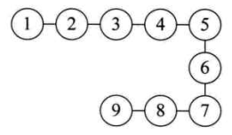
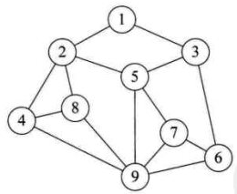

## 一、 基本概念

### 1. 数据

**数据**是描述客观事物的符号，是计算机中可以操作的对象，是能被计算机识别，并输入给计算机处理的符号集合。

数据的分类：

1. 数值类型：整型、实型
2. 非数值类型：字符、声音、图形、视频等

### 2. 数据元素

数据元素值组成数据的、有一定意义的基本单位，在计算机中通常作为整体处理。也被称为记录。

### 3. 数据项

一个数据元素可以有若干个数据项组成。

数据项是数据不可分割的做小单位。

### 4. 数据对象

数据对象时性质相同的数据元素的集合，是数据的子集。

### 5. 数据结构

数据结构是相互之间存在一种多多种特定关系的数据元素的集合。

## 二、逻辑结构与物理结构

按照视角的不同，把数据分为逻辑结构和物理结构

### 1. 逻辑机构

数据对象中欧冠数据元素之间的相互关系

#### 1.1 集合结构

集合结构中的数据元素除了属于同一个集合外，它们之间没有其他关系。

#### 1.2 线性结构

线性结构中的数据之间是一对一的关系

#### 1.3 树形结构

树形结构中的元素之间存在一种一对多的层次关系

#### 1.4 图形结构

图形结构的数据元素之间是多对多的关系

### 2. 物理结构（存储结构）

物理结构值数据的逻辑结构在计算机中的存储形式

#### 2.1 顺序存储结构

数据元素存放在地址连续的存储单元内，数据间的逻辑关系和物理关系是一致的。

#### 2.2 链式存储结构

数据存放在任意的存储单元里，这组存储单元可以是连续的，也可以是不连续的。

## 三、抽象数据类型

抽象数据类型（ADT）是指一个数学模型及定义在该模型上的一组操作。

## 四、算法

算法是解决特定问题求解步骤的描述，在计算机中表现为指令的有限序列，冰鞋每条指令表示一个或多个操作。

### 1. 算法的特性

1. 输入输出：算法具有零个或多个输入，至少有一个或多个输出
2. 有穷性：有限步骤之后自动结束
3. 确定性：每一步骤有确定的含义
4. 可行性

### 2. 算法的设计要求

1. 正确性
2. 可读性
3. 健壮性
4. 时间效率高和存储量低

## 五、算法时间复杂度

### 1. 时间复杂度与大O记法

**大O记法**：对于单调的整数函数f，如果存在一个整数函数g和实常数c>0，使得对于充分大的n总有`f(n)≤c·g(n)`，就说函数g是f的一个渐近函数（忽略常数），记为`f(n)=O(g(n))`。也就是说，在趋向无穷的极限意义下，函数f的增长速度受到函数g的约束，亦即函数f与函数g的特征相似。

**时间复杂度**：假设存在函数g，使得算法A处理规模为n的问题示例所用时间为`T(n)=O(g(n))`，则称`O(g(n))`为算法A的渐近时间复杂度，简称时间复杂度，记为`T(n)`

### 2. 时间复杂度的基本计算规则

1. 基本操作，即只有常数项，认为其时间复杂度为O(1)
2. 顺序结构，时间复杂度按**加法**进行计算
3. 循环结构，时间复杂度按**乘法**进行计算
4. 分支结构，时间复杂度**取最大值**
5. 判断一个算法的效率时，往往只需要关注操作数量的最高次项，其它次要项和常数项可以忽略
6. 在没有特殊说明时，我们所分析的算法的时间复杂度都是指**最坏时间复杂度**

### 3. 常见时间复杂度

| 执行次数函数举例 |    阶    | 非正式术语 |
| ---------------- | :------: | :--------- |
| 12               |   O(1)   | 常数阶     |
| 2n+3             |   O(n)   | 线性阶     |
| 3n^2^+2n+1       | O(n^2^)  | 平方阶     |
| 5log~2~^n^+20    | O(logn)  | 对数阶     |
| 2n+3nlog~2~n+19  | O(nlogn) | nlogn阶    |
| 6n^3^+2n^2^+3n+4 | O(n^3^)  | 立方阶     |
| 2^n^             | O(2^n^)  | 指数阶     |

时间复杂度所消耗的时间大小排序：

O(1) < O(log^n^) < O(n) < O(nlogn) < O(n^2^) < O(n^3^) < O(2^n^) < O(n!) < O(n^n^)

## 六、线性表

线性表：零个或多个数据元素的有限序列

1. 元素之间是有顺序的
2. 若元素存在多个，则第一个元素五前驱，最后一个元素无后继
3. 其他每个元素都有且只有一个前驱和后继
4. 线性表示有限的
5. 线性表元素的个数n(n≥0)定义为线性表的长度，当n=0时，称为空表。
6. 根据线性表的实际存储方式，分为顺序表和链表

### 1. 线性表的顺序存储结构

用一段地址连续的存储单元依次存储线性表的数据元素

优点：

1. 无须为表示表中元素之间的逻辑关系而增加额外的存储空间
2. 可以快速的存取表中任一位置的元素

缺点：

1. 插入和删除操作需要移动大量元素
2. 当线性表长度变化较大时，难以确定存储空间的容量
3. 造成存储空间的碎片

### 2. 线性表的链式存储结构

在链式结构中，为了表示数据元素a~i~与其直接后继数据元素a~i+1~之间的逻辑关系，对于数据a~i~来说，除了存储其本身的信息之外，还需存储一个指示其直接后继的信息（即直接后继的存储位置）。我们把存储数据元素信息的域称为**数据域**，把存储直接后继位置的域称为**指针域**。指针域中存储的信息称为指针或链。这两部分信息组成数据元素a~i~的存储映像，称为**结点**（Node）。

n个结点链成一个链表，即线性表的链式存储结构，因为此链表的每个结点只包含一个指针域，所以叫做**单链表**。

1. 第一个结点的存储位置叫做**头指针**。
2. 链表中最后一个结点指针为空。
3. 为了方便对指针进行操作，会在单链表的第一个结点前附设一个结点，称为**头结点**。头结点的指针域存储指向第一个结点的指针。头结点可以不存储任何信息，也可以存储线性表长度等附加信息。

**头指针与头结点的异同**：

1. 头指针
    1. 头指针是指链表指向第一个结点的指针，若链表有头结点，则是指向头结点的指针
    2. 头指针具有标识作用，所以<u>常用头指针冠以链表的名字</u>
    3. 无论链表是否为空，头指针均不为空。<u>头指针是链表的必要元素</u>

2. 头结点
    1. 头结点是为了操作的统一和方便而设立的，刚在第一元素的结点之前，其数据域一般无意义（也可存放链表的长度）
    2. 有了头结点，对在第一元素结点前插入结点和删除第一结点，其操作与其他结点的操作就统一了
    3. 头结点不一定是链表的必须要素

[来源]: 《大话数据结构》读书笔记

