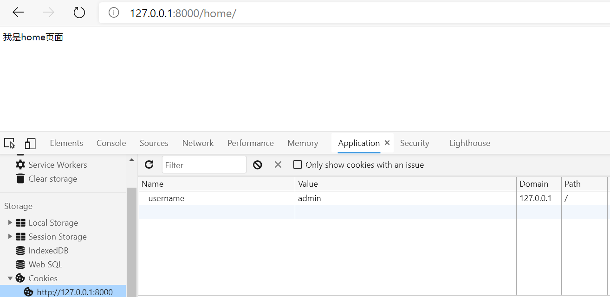

# cookie与session

## 一、cookie

### 1. cookie常用方法

1. set_cookie(key,value)
   - max_age参数：设置超时时间，以秒为单位
   - expires参数：设置超时时间，以秒为单位，针对IE浏览器
2. request.COOKIES.get(key)
3. delete_cookie(key)

### 2. 基于cookie的登录

```python
from django.shortcuts import render, HttpResponse, redirect
from django import forms


def login_auth(func):
    def inner(request, *args, **kwargs):
        target_url = request.get_full_path()
        if request.COOKIES.get('username'):
            return func(request, *args, **kwargs)
        else:
            return redirect('/login/?redirect=%s' % target_url)

    return inner


def login(request):
    if request.method == 'POST':
        username = request.POST.get('username')
        password = request.POST.get('password')
        if username == 'admin' and password == '123':
            # 获取用户上一次想要访问的url
            target_url = request.GET.get('redirect')  # 这个结果可能是None
            if target_url:
                obj = redirect(target_url)
            else:
                # 保存用户登陆状态
                obj = redirect('/home/')
            # 让浏览器记录cookie数据
            obj.set_cookie('username', username)
            """
            浏览器不单单会帮你存
            而且后面每次访问你的时候还会带着它过来
            """
            # 跳转到一个需要用户登陆之后才能看的页面
            return obj
    return render(request, 'login.html')


@login_auth
def home(request):
    return HttpResponse("我是home页面")


@login_auth
def logout(request):
    obj = redirect('/login/')
    obj.delete_cookie('username')
    return obj

```



## 二、session

在默认情况下操作session的时候需要django默认的一张django_session表。

django默认session的过期时间是14天

django_session表中的数据条数是取决于浏览器的，同一个计算机上(IP地址)同一个浏览器只会有一条数据生效。

### 1. session常用方法

1. request.session['key'] = value
2. request.session.get('key')
3. request.session.set_expiry() 4种类型的参数
   - 整数：秒
   - 日期对象：到指定日期就失效
   - 0： 一旦当前浏览器窗口关闭立刻失效
   - 不写：失效时间就取决于django内部全局session默认的失效时间
4. request.session.delete()  只删服务端的，客户端的不删
5. request.session.flush()  浏览器和服务端都清空(推荐使用)

### 2. 内部原理

#### 2.1 设置session时候

1. django内部会自动帮你生成一个随机字符串

       2. django内部自动将随机字符串和对应的数据存储到django_session表中
          - 先在内存中产生操作数据的缓存
          - 在响应结果django中间件的时候才真正的操作数据库

     3. 将产生的随机字符串返回给客户端浏览器保存

#### 2.2 取值时

1. 自动从浏览器请求中获取sessionid对应的随机字符串
2. 拿着该随机字符串去django_session表中查找对应的数据
   - 如果比对上了 则将对应的数据取出并以字典的形式封装到request.session中
   - 如果比对不上 则request.session.get()返回的是None

### 3. session的保存