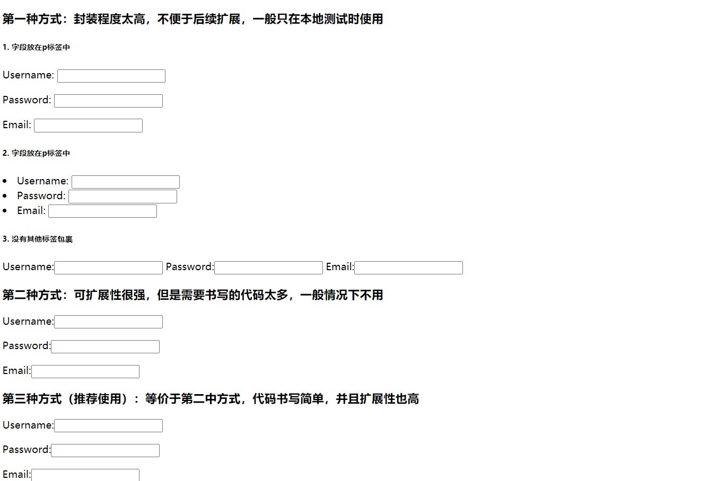

# forms组件

功能：

1. 渲染HTML代码
2. 校验数据
3. 展示提示信息

## 1. 基本使用

```python
# filename: views.py
from django import forms


class MyForm(forms.Form):
    username = forms.CharField(min_length=6, max_length=32)
    password = forms.CharField(min_length=6,max_length=32)
    email = forms.EmailField()
```

## 2. 数据校验

```python
from django.test import TestCase

# Create your tests here.

import os

if __name__ == "__main__":
    os.environ.setdefault("DJANGO_SETTINGS_MODULE", "mysite.settings")
    import django

    django.setup()
    from django import forms


    class MyForm(forms.Form):
        username = forms.CharField(min_length=6, max_length=32)
        password = forms.CharField(min_length=6, max_length=32)
        email = forms.EmailField()


    # 将带校验的数据组织成字典的形式传入
    # 校验数据只校验类中出现的字段，多传的字段直接忽略
    # 默认情况下，类中的所有字段都必须传值
    form_obj = MyForm({'username': 'tom', 'password': '123456', 'email': 'tom@126.com'})
    
    # 判断数据是否合法，只有在所有的数据全部合法的情况下才会返回True
    print(form_obj.is_valid())  # False
    
    # 查看所有不符合校验规则以及不符合的原因
    print(form_obj.errors)  # <ul class="errorlist"><li>username<ul class="errorlist"><li>Ensure this value has at least 6 characters (it has 3).</li></ul></li></ul>
    
    # 查看所有校验通过的数据
    print(form_obj.cleaned_data)  # {'password': '123456', 'email': 'tom@126.com'}

```

## 3. 渲染标签

forms组件只会自动渲染获取用户输入的标签(input select radio checkbox)，不能渲染提交按钮。

视图层：

```python
from django.shortcuts import render
from django import forms


class MyForm(forms.Form):
    username = forms.CharField(min_length=6, max_length=32)
    password = forms.CharField(min_length=6, max_length=32)
    email = forms.EmailField()


def index(request):
    # 第一步：生成一个空对象
    form_obj = MyForm()
    # 直接将该空对象传递给html页面
    return render(request, 'index.html', locals())

```

模板层：

```html
<!DOCTYPE html>
<html lang="en">
<head>
    <meta charset="UTF-8">
    <title>Title</title>
    
    <script src=""></script>
</head>
<body>
<form action="" method="post">
    <h3>第一种方式：封装程度太高，不便于后续扩展，一般只在本地测试时使用</h3>
    <h6>1. 字段放在p标签中</h6>
    {{ form_obj.as_p }}
    <h6>2. 字段放在p标签中</h6>
    {{ form_obj.as_ul }}
    <h6>3. 没有其他标签包裹</h6>
    {{ form_obj.as_table }}
    <h3>第二种方式：可扩展性很强，但是需要书写的代码太多，一般情况下不用</h3>
    {#对象.字段.字段的属性#}
    <p>{{ form_obj.username.label }}:{{ form_obj.username }}</p>
    <p>{{ form_obj.password.label }}:{{ form_obj.password }}</p>
    <p>{{ form_obj.email.label }}:{{ form_obj.email }}</p>
    <h3>第三种方式（推荐使用）：等价于第二中方式，代码书写简单，并且扩展性也高</h3>
    
        <p>{{ form.label }}:{{ form }}</p>
    
    
</form>
</body>
</html>
```

渲染结果



## 4. 展示错误信息

### 4.1 基本使用

视图层

```python
from django.shortcuts import render, HttpResponse
from django import forms


class MyForm(forms.Form):
    username = forms.CharField(min_length=6, max_length=32, label='用户名')
    password = forms.CharField(min_length=6, max_length=32, label='密码')
    email = forms.EmailField(label='邮箱')


def index(request):
    # 1. 生成一个空对象
    form_obj = MyForm()
    if request.method == 'POST':
        # 3.校验数据
        form_obj = MyForm(request.POST)  # request.POST可以看成就是一个字典
        # 4. 判断数据是否合法
        if form_obj.is_valid():
            # 如果合法，执行操作
            return HttpResponse('ok')
        # 5.不合法 有错误
    # 2. 直接将该空对象传递给html页面
    return render(request, 'index.html', locals())


# 1. get请求和post传给html页面对象变量名必须一样
# 2. forms组件当数据不合法的情况下,会保存上次的数据
```

模板层：

```html
<!DOCTYPE html>
<html lang="en">
<head>
    <meta charset="UTF-8">
    <title>Title</title>
</head>
<body>
<form action="" method="post" novalidate> {# novalidate 让前端不校验数据 #}
    
        <p>
            {{ form.label }}:{{ form }}
            <span style="color: red">{{ form.errors.0 }}</span>
        </p>
    
<input type="submit">
</form>
</body>
</html>
```

渲染效果


### 4.2 定制错误信息

```python

class MyForm(forms.Form):
    username = forms.CharField(min_length=6, max_length=12, label='用户名',
                               error_messages={
                                   'min_length': '用户名最少6位',
                                   'max_length': '用户名最大12位',
                                   'required': "用户名不能为空"
                               }
                               )
    password = forms.CharField(min_length=6, max_length=32, label='密码',
                               error_messages={
                                   'min_length': '密码最少6位',
                                   'max_length': '密码最大32位',
                                   'required': "密码不能为空"
                               })
    email = forms.EmailField(label='邮箱',
                             error_messages={
                                 'invalid': '邮箱格式不正确',
                                 'required': "邮箱不能为空"
                             })
```

## 5. 钩子函数

```python
class MyForm(forms.Form):
    username = forms.CharField(min_length=6, max_length=32, label='用户名')
    password = forms.CharField(min_length=6, max_length=32, label='密码')
    confirm_password = forms.CharField(min_length=6, max_length=32, label='确认密码')
    email = forms.EmailField(label='邮箱')

    # 钩子函数  在类里面书写方法即可
    # 1. 局部钩子 需要给单个字段增加校验规则的时候可以使用
    def clean_username(self):
        # 获取到用户名
        username = self.cleaned_data.get('username')
        if '666' in username:
            # 提示前端展示错误信息
            self.add_error('username', '光喊666是不行滴～')
        # 将钩子函数钩去出来数据再放回去
        return username

    # 2. 全局钩子 需要给多个字段增加校验规则的时候可以使用
    def clean(self):
        password = self.cleaned_data.get('password')
        confirm_password = self.cleaned_data.get('confirm_password')
        if not confirm_password == password:
            self.add_error('confirm_password', '两次密码不一致')
        # 将钩子函数钩出来数据再放回去
        return self.cleaned_data
```

## 6. forms组件常用参数

```python
label # 字段名
error_messages  # 自定义报错信息
initial  # 默认值
required  # 控制字段是否必填
validators=[
            RegexValidator(r'^[0-9]+$', '请输入数字'),
            RegexValidator(r'^159[0-9]+$', '数字必须以159开头')
        ]  # 正则校验 from django.core.validators import RegexValidator
widget=forms.widgets.PasswordInput(attrs={'class':'form-control c1 c2'})  # attrs 这是属性，比如添加bootstrap样式
```

不同类型的`input`:

```python
# radio
gender = forms.ChoiceField(
    choices=((1, "男"), (2, "女"), (3, "保密")),
    label="性别",
    initial=3,
    widget=forms.widgets.RadioSelect()
)
# select
hobby = forms.ChoiceField(
    choices=((1, "篮球"), (2, "足球"), (3, "双色球"),),
    label="爱好",
    initial=3,
    widget=forms.widgets.Select()
)
# 多选
hobby1 = forms.MultipleChoiceField(
    choices=((1, "篮球"), (2, "足球"), (3, "双色球"),),
    label="爱好",
    initial=[1, 3],
    widget=forms.widgets.SelectMultiple()
)
# 单选checkbox
keep = forms.ChoiceField(
    label="是否记住密码",
    initial="checked",
    widget=forms.widgets.CheckboxInput()
)
# 多选checkbox
hobby2 = forms.MultipleChoiceField(
    choices=((1, "篮球"), (2, "足球"), (3, "双色球"),),
    label="爱好",
    initial=[1, 3],
    widget=forms.widgets.CheckboxSelectMultiple()
)
```

## 7. form表单上传文件及后端操作

### 1. 前端

form表单上传文件类型的数据

1. method必须指定成`post`

2. enctype必须换成`multipart/form-data`

```html
<form action="" method="post" enctype="multipart/form-data">
    <p>file:<input type="file" name="file"></p>
    <input type="submit">
</form>
```

### 2. 后端

```python
def upload_file(request):
    if request.method == 'POST':
        print(request.body)  # 原生的浏览器发过来的二进制数据
        print(request.FILES)  # 获取文件数据 <MultiValueDict: {'file': [<InMemoryUploadedFile: ebc.jpg (image/jpeg)>]}>
        file_obj = request.FILES.get('file')  # 文件对象
        print(file_obj.name) # abc.jpg
        with open(file_obj.name,'wb') as f:
            for line in file_obj.chunks():  # 推荐加上chunks方法 其实跟不加是一样的都是一行行的读取
                f.write(line)
    return render(request, 'upload_file.html')
```

