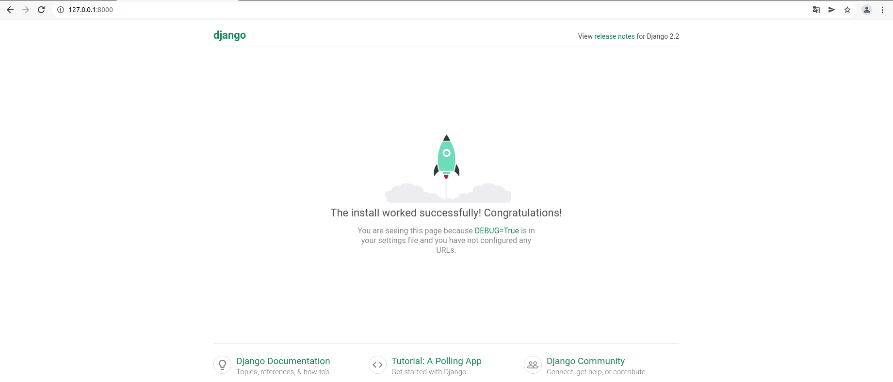

## 一、安装

### 1. 创建虚拟环境

```bash
$ mkdir DjangoProject
$ python3 -m venv DjangoProject/Djangovenv
$ cd DjangoProject
$ source Djangovenv/bin/activate # 激活虚拟环境
```

### 2. 安装指定版本的`Django`

通过https://www.djangoproject.com/download/#supported-versions可以查看版本发布计划，选择需要安装的版本。

```bash
$ pip3 install django==2.2.25
```

## 二、创建一个项目

### 1. 创建项目

创建一个名为`mysite`的`Django`项目

```bash
$ django-admin startproject mysite
$ tree mysite/
mysite/
├── manage.py
└── mysite
    ├── __init__.py
    ├── settings.py
    ├── urls.py
    └── wsgi.py
```

### 2. 启动`Django`项目

```bash
$ cd mysite
$ python3 manage.py runserver 127.0.0.1:8000
$ tree
.
├── db.sqlite3
├── manage.py
└── mysite
    ├── __init__.py
    ├── __pycache__
    │   ├── __init__.cpython-38.pyc
    │   ├── settings.cpython-38.pyc
    │   ├── urls.cpython-38.pyc
    │   └── wsgi.cpython-38.pyc
    ├── settings.py
    ├── urls.py
    └── wsgi.py
```

用浏览器访问http://127.0.0.1:8000/



### 3. 创建应用

```bash
$ python3 manage.py startapp app
$ tree .
.
├── app  # 新创建的文件夹
│   ├── admin.py  		# 后台管理
│   ├── apps.py  		# 注册应用
│   ├── __init__.py
│   ├── migrations  	# 数据库迁移记录
│   │   └── __init__.py
│   ├── models.py  		# 数据库模型类
│   ├── tests.py		# 测试文件
│   └── views.py  		# 视图函数
├── db.sqlite3			# 自带的sqlite数据库
├── manage.py			
└── mysite
    ├── __init__.py
    ├── __pycache__
    │   ├── __init__.cpython-38.pyc
    │   ├── settings.cpython-38.pyc
    │   ├── urls.cpython-38.pyc
    │   └── wsgi.cpython-38.pyc
    ├── settings.py  	# 配置文件
    ├── urls.py  		# 路由相关
    └── wsgi.py			# wsgiref
```

### 4. 注册应用

每创建一个应用都需要注册到项目中。

注册方法：修改`mysite/mysite/settings.py`文件

```python
# Django项目默认自带了如下的应用（功能模块）
INSTALLED_APPS = [
    'django.contrib.admin',
    'django.contrib.auth',
    'django.contrib.contenttypes',
    'django.contrib.sessions',
    'django.contrib.messages',
    'django.contrib.staticfiles',
    'app.apps.AppConfig', # 添加此行
    # 'app'  # 可以简写
]
```

## 三、基本使用

### 1. 创建视图函数

在`mysite/app/views.py`中编写视图函数

```python
from django.http import HttpResponse
from django.shortcuts import render

# Create your views here.
def index(request):
    return HttpResponse("Hello World")
```

### 2. 注册路由

在`mysite/urls.py`中添加视图函数和路由的映射

```python
from django.contrib import admin
from django.urls import path
from app import views  # 1. 导入app下的views
urlpatterns = [
    path('admin/', admin.site.urls),
    path('index/', views.index),  # 2. 路由和视图函数的映射
]
```

### 3. 重新启动`Django`项目


## 四、请求生命周期

### 1. 浏览器

​	发送HTTP请求

### 2. Web服务网管接口

#### 2.1 作用

处理请求流程：请求来的时候解析封装，响应走的时候打包处理

#### 2.2 实现

1. wsgiref模块，django默认模块，不能承受高并发
2. uwsgi模块，可以支持高并发
3.  两个模块都是WSGI协议的实现

### 3. Django后端

#### 3.1 中间件

#### 3.2 路由层

识别路由匹配对应的视图函数

#### 3.3 视图层

网站整体的业务逻辑

#### 3.4 模板层

网站所有的html文件

#### 3.5 模型层

数据库相关

### 4. 流程

1. Django从收到消息中，从请求消息中分解出用户访问的路径
2. 拿着得到的路径在路径和函数的对应关系列表中进行匹配，匹配之后执行函数
3. 执行函数，把所有和请求相关的数据封装到一个request参数中
4. render找到html文件，打开并读取文件内容，按照http响应消息的格式封装，返回给用户的浏览器
5. 浏览器收到响应的消息，按照HTML的格式展示页面   