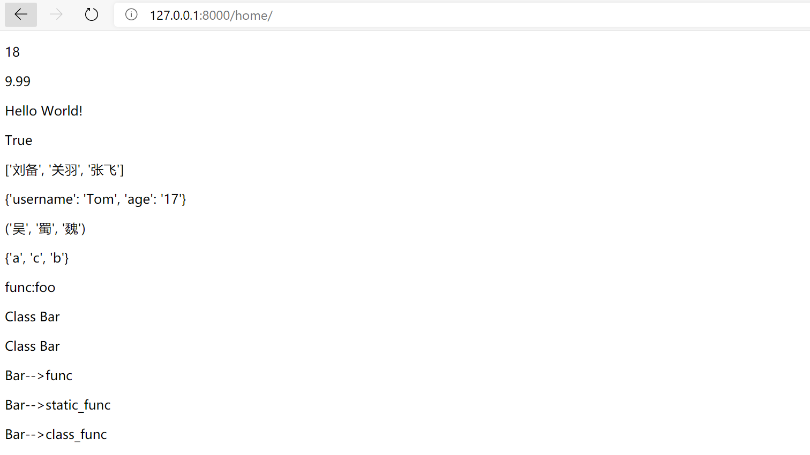
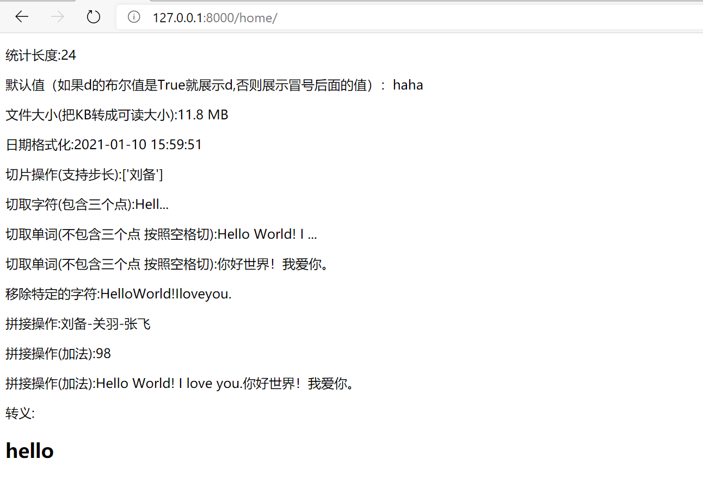
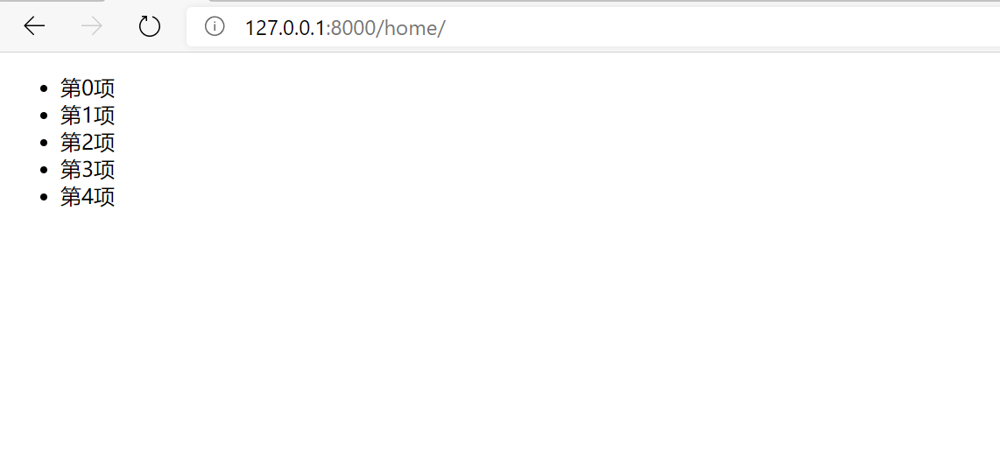

## 一、模板文件配置

### 1. 在应用下创建`templates`目录

```bash
cd mysite/
mkdir app/templates
```

### 2. 在项目的配置文件中添加`templates`路径

```python
TEMPLATES = [
    {
        'BACKEND': 'django.template.backends.django.DjangoTemplates',
        'DIRS': [os.path.join(BASE_DIR, 'templates')],  # 添加此行
        'APP_DIRS': True,
        'OPTIONS': {
            'context_processors': [
                'django.template.context_processors.debug',
                'django.template.context_processors.request',
                'django.contrib.auth.context_processors.auth',
                'django.contrib.messages.context_processors.messages',
            ],
        },
    },
]
```

## 二、静态文件配置

### 1. 创建静态文件目录

```bash
$ mkdir mysite/app/static
# 网站使用的静态文件(css,js,img)一般都放在static目录下
```

一般情况下都会对static下的资源详细划分

```bash
$ mkdir mysite/app/static/{js,css,images}
tree mysite/app/static/
mysite/app/static/
├── css
├── images
├── js
└── bootstrap # (其他三方库，比如bootstrap)

```

### 2. 修改配置文件

```python
# 如果想访问静态文件，模板文件中的静态文件路径就必须以static开头，
# 然后从STATICFILES_DIRS中给的路径从上到下依次查找指定的静态文件，如果没找到就报错
STATIC_URL = '/static/'

# 添加以下内容
STATICFILES_DIRS = [
    os.path.join(BASE_DIR, 'static'),
    os.path.join(BASE_DIR, 'static1'),
    os.path.join(BASE_DIR, 'static2'),
]
```

### 3. 静态文件动态解析

```html
<!DOCTYPE html>
<html lang="en">
<head>
    <meta charset="UTF-8">
    <title>登录</title>
      <!--类似于导入模块，可以动态解析配置文件中STATIC_URL的值-->
    <link rel="stylesheet" href="">
    <script src=""></script>
</head>
<body>
<h1 class="text-center">登陆</h1>
<div class="container">
    <div class="row">
        <div class="col-md-8 col-md-offset-2">
            <form action="/index/" method="post">>
                <p>username:<input type="text" name="username" class="form-control"></p>
                <p>password:<input type="password" name="password" class="form-control"></p>
                <input type="submit" class="btn btn-success btn-block">
            </form>
        </div>
    </div>
</div>
</body>
</html>
```


## 二、模板语法

### 1. 语法

```jinja2
{{ }}:变量相关
:逻辑相关
```

### 2. 值传递

 模版语法可以传递的后端python数据类型

视图函数

```python
from django.shortcuts import render


def home(request):
    n = 18
    f = 9.99
    s = 'Hello World!'
    b = True
    l = ['刘备', '关羽', '张飞']
    t = ('吴', '蜀', '魏')
    d = {'username': 'Tom', 'age': '17'}
    st = {'a', 'b', 'c'}

    def foo():
        return 'func:foo'

    class Bar:
        def func(self):
            return 'Bar-->func'

        @staticmethod
        def static_func():
            return 'Bar-->static_func'

        @classmethod
        def class_func(cls):
            return 'Bar-->class_func'

        def __str__(self):
            return 'Class Bar'

    obj = Bar()
    return render(request, 'home.html', locals())
```

模板

```html
<!DOCTYPE html>
<html lang="en">
    <head>
        <meta charset="UTF-8">
        <title>home</title>
    </head>
    <body>
        <p>{{ n }}</p>
        <p>{{ f }}</p>
        <p>{{ s }}</p>
        <p>{{ b }}</p>
        <p>{{ l }}</p>
        <p>{{ d }}</p>
        <p>{{ t }}</p>
        <p>{{ st }}</p>
        <p>{{ foo }}</p>
        <p>{{ Bar }}</p>
        <p>{{ obj }}</p>
        <p>{{ obj.func }}</p>
        <p>{{ obj.static_func }}</p>
        <p>{{ obj.class_func }}</p>
    </body>
</html>
```

1. 传递函数名会自动加括号调用，但是模版语法不支持给函数传额外的参数
2. 传类名的时候也会自动加括号调用(实例化)
3. 内部能够自动判断出当前的变量名是否可以加括号调用，如果可以就会自动执行（针对的是函数名和类名）

渲染后的页面



### 3. 取值

django模版语法的取值是固定的格式，只能采用句点符(`.`)

1. `.键`：`{{ d.username }}  `
2. `.索引`：`{{ d.hobby.3.info }}`

### 4. 过滤器

语法：`{{数据|过滤器:参数}}`

#### 4.1 内置过滤器

视图层

```python
#filename: urls.py
from django.shortcuts import render
import datetime


def home(request):
    n = 88
    s = 'Hello World! I love you.'
    msg = "你好世界！我爱你。"
    l = ['刘备', '关羽', '张飞']
    file_size = 12321483
    current_time = datetime.datetime.now()
    h = '<h2>hello</h2>'
    return render(request, 'home.html', locals())
```

模板层

```django
<!DOCTYPE html>
<html lang="en">
<head>
    <meta charset="UTF-8">
    <title>home</title>
</head>
<body>
<p>统计长度:{{ s|length }}</p>
<p>默认值（如果d的布尔值是True就展示d,否则展示冒号后面的值）：{{ d|default:"haha" }}</p>
<p>文件大小(把KB转成可读大小):{{ file_size|filesizeformat }}</p>
<p>日期格式化:{{ current_time|date:'Y-m-d H:i:s' }}</p>
<p>切片操作(支持步长):{{ l|slice:'0:2:2' }}</p>
<p>切取字符(包含三个点):{{ s|truncatechars:7 }}</p>
<p>切取单词(不包含三个点 按照空格切):{{ s|truncatewords:3 }}</p>
<p>切取单词(不包含三个点 按照空格切):{{ msg|truncatewords:3 }}</p>
<p>移除特定的字符:{{ s|cut:' ' }}</p>
<p>拼接操作:{{ l|join:'-' }}</p>
<p>拼接操作(加法):{{ n|add:10 }}</p>
<p>拼接操作(加法):{{ s|add:msg }}</p>
<p>转义:{{ h|safe }}</p>
</body>
</html>
```

渲染结果



后端转义

```python
from django.shortcuts import render
from django.utils.safestring import mark_safe


def home(request):
    res = mark_safe('<h1>Hello</h1>')
    return render(request, 'home.html', locals())
```

```django
<!DOCTYPE html>
<html lang="en">
<head>
    <meta charset="UTF-8">
    <title>home</title>
</head>
<body>
<p>后端转义:{{ res }}</p>
</body>
</html>
```

#### 4.2 自定义过滤器

**步骤：**

1. 在应用下创建一个名字”必须“叫`templatetags`的文件夹

2. 在该文件夹内创建“任意”名称的`py`文件eg:`mytag.py`

3. 在该`py`文件内"必须"先书写下面两句话(单词一个都不能错)

   ```python
   from django import template
   register = template.Library()
   ```

定义过滤器

```python
#filename: templatetags/mytag.py
from django import template

register = template.Library()


@register.filter(name='my_add')  # name="过滤器的名称"
def my_sum(v1, v2):
    return v1 + v2
```

使用

```django

<p>{{ n|my_add:66 }}</p>
```


### 5. 标签 

#### 5.1 `for` 

```django

    <p>{{ foo }}</p>

```

for循环内置变量

```django

    <p>{{ forloop }}</p>

```

```html
{'parentloop': {}, 'counter0': 0, 'counter': 1, 'revcounter': 3, 'revcounter0': 2, 'first': True, 'last': False}
{'parentloop': {}, 'counter0': 1, 'counter': 2, 'revcounter': 2, 'revcounter0': 1, 'first': False, 'last': False}
{'parentloop': {}, 'counter0': 2, 'counter': 3, 'revcounter': 1, 'revcounter0': 0, 'first': False, 'last': True}
```

处理字典

```django

    <p>{{ foo }}</p>


    <p>{{ foo }}</p>


    <p>{{ k }}-->{{ v }}</p>

```

empty

```django

    <p>{{ forloop }}</p>

    <p>循环对象没有内容，就显示这行</p>

```

#### 5.2 `if`

```django

    <p>真棒</p>

    <p>还行</p>

    <p>努力吧，少年!</p>

```

支持的运算符

```python
in
or and not
==, !=, <, >, <=, >=
```

#### 5.3 `with`起别名

  在with语法内就可以通过as后面的别名快速的使用到前面非常复杂获取数据的方式

```django

    <p>列表长度:{{ count }}</p>

```

#### 5.4 自定义标签

自定义标签的参数可以有多个

```python
# filename: templatetags/mytag.py
from django import template

register = template.Library()


@register.simple_tag(name='my_plus') # name="标签的名称"
def plus_plus(a, b, c, d):
    return '%s-%s-%s-%s' % (a, b, c, d)

```

使用

```django

<p></p>
```

#### 5.5 自定义`inclusion_tag`

当html页面某一个地方的页面需要传参数才能够动态的渲染出来，并且在多个页面上都需要使用到该局部 那么就考虑将该局部页面做成`inclusion_tag`形式

内部原理：

1. 先定义一个方法
2. 在页面上调用该方法并且可以传值
3. 该方法会生成一些数据然后传递给一个html页面
4. 之后将渲染好的结果放到调用的位置

定义inclusion_tag

```python
from django import template

register = template.Library()


@register.inclusion_tag('menu_list.html')   # 数据返回给哪个页面去处理
def show(n):
    data = ['第{}项'.format(i) for i in range(n)]
    return locals() # 将data传递给home.html
```

show函数处理的结果在`menu_list.html`中处理

```django
    
        <li>{{ foo }}</li>
    
```

渲染后的页面在其他页面中使用

```django
<!DOCTYPE html>
<html lang="en">
<head>
    <meta charset="UTF-8">
    <title>主页</title>
</head>
<body>
    
    
</body>
</html>
```

访问结果



## 三、模板继承

当网站页面整体都差不多，只是某一些局部在做变化 ，就可以用到模板继承。

1. 先定义一个模板页面，在模版页面上提前划定可以被修改的区域
2. 子页面继承模板，在划定的区域定制修改子页面的内容
3. 一般情况下模版页面上应该至少有三块可以被修改的区域（css，js，html）

### 1. 模板页面的定义

```django
<!DOCTYPE html>
<html lang="en">
<head>
    <meta charset="UTF-8">
    <title>Title</title>
    

    
</head>
<body>
    
    <p>模板页面内容</p>
    
    
    
    
</body>
</html>
```

### 2. 子页面继承

```django


    <p>子页面内容</p>

```

子页面中继续引用模板的内容

```django


    子页面内容
    {{ block.super }}
    子页面内容

```


## 四、模板导入

将页面的某一个局部当成模块的形式，哪个地方需要就可以直接导入使用即可

```django

```

