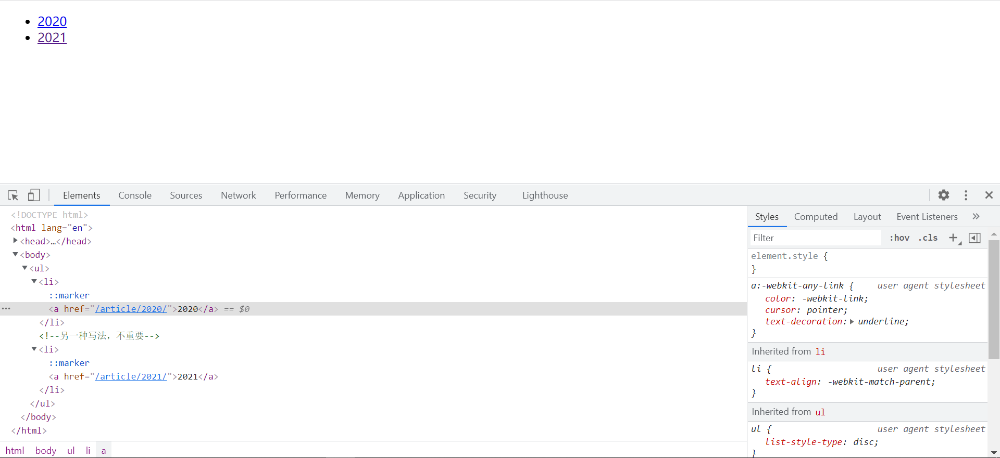
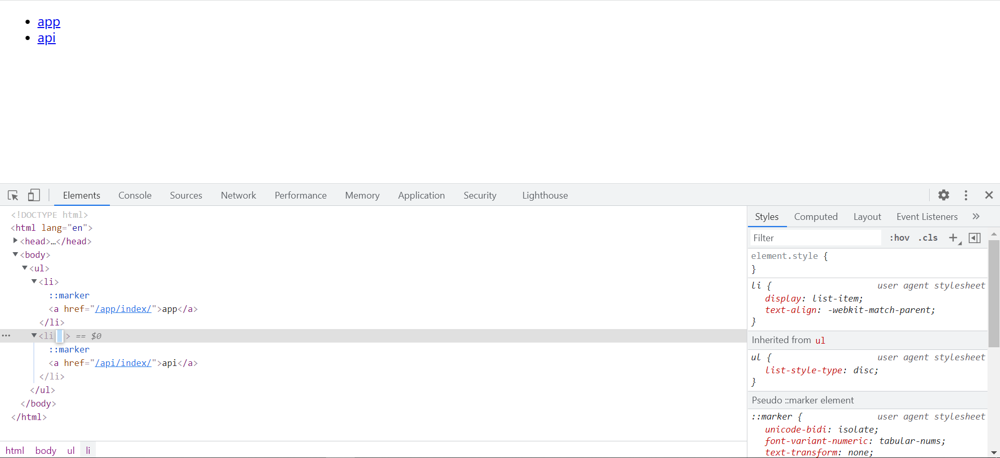

# 路由

## 一、路由匹配

### 1. 在`mysite/mysite/urls.py`中书写路由

```python
from django.contrib import admin
from django.urls import path
from app import views

urlpatterns = [
    path('admin/', admin.site.urls),
    path('index/', views.index),
]
```

> 在浏览器输入http://127.0.0.1:8000/index时，`Django`会做一次301重定向（自动在URL后面加`/`，重新请求一次）。
>
> 可以再配置文件中添加`APPEND_SLASH = False`来取消自动加`/`重定向

### 2. 路由转换

#### 2.1. 默认转换器

`Django`默认提供了5种转换器

| 转换器 | 作用                                                    | 示例                                   |
| ------ | ------------------------------------------------------- | -------------------------------------- |
| `str`  | 匹配除了`/`之外的非空字符串                             | `Tom`                                  |
| `int`  | 匹配0或者任何正整数，返回一个int                        | `18`                                   |
| `path` | 匹配任意由ASCII字母或数字以及连字符和下划线组成的短标签 | `01_abc`                               |
| `slug` | 匹配非空字段，包括路径分隔符`/`                         | `/stc/passwd`                          |
| `uuid` | 匹配一个`UUID`                                          | `b6619e8f-7f66-4c08-88e2-740c3da369da` |

在`mysite/urls.py`编写路由

```python
from django.contrib import admin
from django.urls import path
from app import views

urlpatterns = [
    path('admin/', admin.site.urls),
    path('hello/<str:username>/', views.hello),
    path('hello/<int:age>', views.hello),
    path('hello/<uuid:blkid>', views.hello),
    path('hello/<slug:filename>', views.hello),
    path('hello/<path:path>', views.hello),
]
```

在`mysite/app/views.py`中打印匹配到的值

```python
def hello(request, *args, **kwargs):
    print("URL: %s, args: %s, kwargs: %s" % (request.build_absolute_uri(), args, kwargs))
    return HttpResponse("Hello World")
```

在浏览器中发起请求，测试接收到的值

```
URL: http://127.0.0.1:8000/hello/Tom/, args: (), kwargs: {'username': 'Tom'}
URL: http://127.0.0.1:8000/hello/18, args: (), kwargs: {'age': 18}
URL: http://127.0.0.1:8000/hello/b6619e8f-7f66-4c08-88e2-740c3da369da, args: (), kwargs: {'blkid': UUID('b6619e8f-7f66-4c08-88e2-740c3da369da')}
URL: http://127.0.0.1:8000/hello//etc/passwd, args: (), kwargs: {'path': '/etc/passwd'}
URL: http://127.0.0.1:8000/hello/01_abc, args: (), kwargs: {'filename': '01_abc'}
```

#### 2.2 自定义转换器

```python
from django.contrib import admin
from django.urls import path, register_converter
from app import views


class PhoneConverter:
    regex = "(13[0-9]|14[01456879]|15[0-35-9]|16[2567]|17[0-8]|18[0-9]|19[0-35-9])[0-9]{8}"

    def to_python(self, value):
        return str(value)

    def to_url(self, value):
        return str(value)


register_converter(PhoneConverter, 'phone')
urlpatterns = [
    path('admin/', admin.site.urls),
    path('hello/<phone:phone_number>/', views.hello)
]
```


### 

`re_path()`方法的第一个参数是正则表达式，只要第一个参数正则表达式能够匹配到内容 那么就会立刻停止往下匹配，直接执行对应的视图函数。

## 二. 分组

分组：将某一段正则表达式用小括号扩起来

### 1. 无名分组

**无名分组**就是将括号内正则表达式匹配到的内容当作**位置**参数传递给后面的视图函数。

```python
from django.contrib import admin
from django.urls import path, re_path
from app import views

urlpatterns = [
    path('admin/', admin.site.urls),
    re_path('article/(\d{4})', views.article)  # 无名分组
] 
```

视图函数中形参的名字可以是任意的字符串

```python
from django.shortcuts import HttpResponse

# 形参的名字可以是任意的字符串
def article(request, arg):
    return HttpResponse("%s年的文章" % arg)
```

### 2. 有名分组

**有名分组**就是将括号内正则表达式匹配到的内容当作**关键字参数**传递给后面的视图函数。

```python
from django.urls import path, re_path
from django.contrib import admin
from app import views

urlpatterns = [
    path(r'^admin/', admin.site.urls),
    re_path(r'^article/(?P<year>\d{4})', views.article)  # 给正则表达式起一个别名
]
```

视图函数中形参的名字必须是路由中正则表达式的别名

```python
from django.shortcuts import HttpResponse

# 形参的名字是正则表达式的别名
def article(request, year):
    return HttpResponse("%s年的文章" % year)
```

无名分组和有名分组不可以混合使用，但是同一个分组可以重复使用多次

```python
urlpatterns = [
    re_path(r'^article/([0-9]{4})/([0-9]{2})/([0-9]+)/$', views.article),
    re_path(r'^article/(?P<year>[0-9]{4})/(?P<month>[0-9]{2})/(?P<day>[0-9]{2})/$', views.article),
]
```

## 三、反向解析

### 1. 普通解析

通过一些方法得到一个结果，该结果可以直接访问对应的`url`触发视图函数

第一步：给路由与视图函数起别名

```python
from django.urls import path, re_path
from django.contrib import admin
from app import views

urlpatterns = [
    path(r'^admin/', admin.site.urls),
    path(r'^login/', views.login),
    # 给路由和视图函数起一个别名
    re_path(r'register/', views.reg_func, name="reg")
]
```

第二步：后端反向解析

```python
from django.shortcuts import render, reverse


def login(request):
    return render(request, 'login.html')


def reg_func(request):
    print(reverse('reg'))  # /register/
    return render(request, 'register.html')
```

第三步：前端反向解析

```html
<!DOCTYPE html>
<html lang="en">
<head>
    <meta charset="UTF-8">
    <title>登录</title>
</head>
<body>
<ul>
    <li><a href="#">登录</a></li>
    <!--跳转到http://127.0.0.1:8000/register/-->
    <li><a href="">注册</a></li> 
</ul>
</body>
</html>
```


### 2. 无名有名分组反向解析

#### 2.1 无名分组反向解析

第一步：路由

```python
from django.urls import path, re_path
from django.contrib import admin
from app import views

urlpatterns = [
    path('admin/', admin.site.urls),
    path('home/', views.home),
    re_path('article/(\d{4})/', views.article, name='new_article')
]
```

第二步：后端反向解析

```python
from django.shortcuts import HttpResponse, reverse, render


def home(request):
    return render(request, 'home.html')


def article(request, arg):
    year = arg
    url = reverse('new_article', args=(arg,))  # 解释的时候需要加一个参数
    return HttpResponse('url的值是%s,arg的是值是%s' % (url, year))  # url的值是/article/1999/,arg的是值是1999
```

第三步：前端反向解析

```html
<!--filename:home.html-->
<!DOCTYPE html>
<html lang="en">
<head>
    <meta charset="UTF-8">
    <title>home</title>
</head>
<body>
<ul>
    <li><a href="">2020</a></li>
    <li><a href="">2021</a></li>
</ul>
</body>
</html>
```

#### 2.2 有名分组反向解析

第一步：路由

```python
from django.urls import path, re_path
from django.contrib import admin
from app import views

urlpatterns = [
    path('admin/', admin.site.urls),
    path('home/', views.home),
    re_path('article/(?P<year>\d{4})/', views.article, name='new_article')
]
```

第二步：后端解析

```python
from django.shortcuts import render, HttpResponse, reverse


def home(request):
    return render(request, 'home.html')


def article(request, year):
    print(reverse('new_article', kwargs={'year': year}))  # 另一种写法
    url = reverse('new_article', args=(year,))
    return HttpResponse('url的值是%s,arg的是值是%s' % (url, year))
```

第三步：前端解析

```html
<!DOCTYPE html>
<html lang="en">
<head>
    <meta charset="UTF-8">
    <title>home</title>
</head>
<body>
<ul>
    <li><a href="">2020</a></li> <!--另一种写法，不重要-->
    <li><a href="">2021</a></li>
</ul>
</body>
</html>
```



## 四、路由分发

`django`的每一个应用都可以有自己的`templates`目录、`urls.py`、`static`目录，基于上述的特点，`django`能够非常好的做到按模块开发，每一个功能模块对应一个`app`，最后在配置文件里面注册所有的`app`再利用路由分发的特点将所有的`app`整合成一个完整的项目。

当一个`django`项目中的`url`特别多的时候，总路由`urls.py`代码非常冗余不好维护，这个时候也可以利用路由分发来减轻总路由的压力。

利用路由分发之后，总路由不再处理路由与视图函数的直接对应关系，而是做一个分发处理， 识别当前`url`是属于哪个应用下，然后直接分发给对应的应用去处理。

### 1 . 子路由配置

在各自的`app`下创建`urls.py`

在名为`app`的应用下创建`urls.py`

```python
from django.urls import path

from app import views

urlpatterns = [
    path('index/', views.index)
]
```

在名为`api`的应用下创建`urls.py`

```python
from django.urls import path

from api import views

urlpatterns = [
    path('index/', views.index)
]
```

### 2. 总路由配置

#### 2.1 方式一

```python
from django.urls import path, include
from django.contrib import admin
from app import urls as app_urls
from api import urls as api_urls

urlpatterns = [
    path('admin/', admin.site.urls),
    path('app/', include(app_urls)),
    path('api/', include(api_urls)),
]
```

#### 2.2 方式二（推荐写法）

```python
from django.urls import path, include
from django.contrib import admin

urlpatterns = [
    path('admin/', admin.site.urls),
    path('app/', include('app.urls')),
    path('api/', include('api.urls')),
]
```

## 五、名称空间

当多个应用出现了相同的别名，正常情况下的反向解析是没有办法自动识别前缀的。

### 1. 子路由

`app/urls.py`

```python
from django.urls import path

from app import views

app_name = 'app'
urlpatterns = [
    path('index/', views.index, name='index'),
    path('home/', views.home),
]
```

`api2/urls.py`

```python
from django.urls import path

from api import views

app_name = 'api'
urlpatterns = [
    path('index/', views.index, name='index')
]
```

### 2. 总路由

```python
from django.urls import path, include
from django.contrib import admin

urlpatterns = [
    path('admin/', admin.site.urls),
    path('app/', include('app.urls', namespace='app')),
    path('api/', include('api.urls', namespace='api')),
]
```

### 

### 3. 模板层

```jinja2
<!DOCTYPE html>
<html lang="en">
<head>
    <meta charset="UTF-8">
    <title>home</title>
</head>
<body>
<ul>
    <li><a href="">app</a></li>
    <li><a href="">api</a></li>
</ul>
</body>
</html>
```



> 其实只要保证名字不冲突就没有必要使用名称空间，一般情况下有多个`app`的时候时，在起别名的时候加`app`的前缀就能够确保多个`app`之间名字不冲突。
>
> `path('index/', views.index, name='api_index')`


